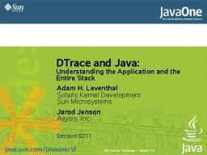

Thanks to everyone who attended Jarod's and my talk this afternoon at JavaOne and especially to those who had to go to the overflow room. The rest of the DTrace team and I were thrilled by the turnout -- we would never have thought that 900+ Java developers would be so interested in DTrace. We spent the next few hours hashing out some ways to get better support for Java in DTrace; we look forward to giving an update at next year's conference.

As promised, here are the slides from the talk:

[](http://dtrace.org/resources/ahl/j1dtrace.pdf)

To get started with the dvm provider on your [Solaris 10](http://www.sun.com/software/solaris/) system, download the agent [here](https://solaris10-dtrace-vm-agents.dev.java.net/). You may need to set your LD\_LIBRARY\_PATH to point to wherever you install it. Then invoke java with the -Xrundvmti:all option.

I wasn't able to capture the command history as was requested, but [Bryan](http://blogs.sun.com/bmc) wrote up a [nice post](http://blogs.sun.com/roller/page/bmc?entry=demo_ing_dtrace) which can be used for the first part of the talk, and here are some of the java-specific commands from today.

```
# dtrace -n dvm`pgrep java`:::method-entry'{ @[copyinstr(arg0), copyinstr(arg1)] = count() }'
# dtrace -n dvm`pgrep java`:::object-alloc'{ @[jstack(20, 8000)] = count() }'
# dtrace -n dvm`pgrep java`:::object-alloc'/copyinstr(arg0) == "java/awt/Rectangle"/{}'

```

Try mixing and matching. Check out the [Solaris Dynamic Tracing Guide](http://docs.sun.com/db/doc/817-6223) for the exhaustive reference guide. If you have questions or want to figure out some more scripts, feel free to post a question here or -- even better -- on the [DTrace forum](http://www.opensolaris.org/jive/forum.jspa?forumID=7) on [opensolaris.org](http://opensolaris.org).

* * *

Technorati Tags: [DTrace](http://technorati.com/tag/DTrace) [JavaOne](http://technorati.com/tag/JavaOne)
