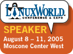

 I really never thought I'd be sticking a picture of a penguin on my weblog, but here it is...

Joined by [Bryan](/bmc) and [Eric](/eschrock), I'll be speaking (and listening) at the [OpenSolaris BoF](http://www.linuxworldexpo.com/live/12/events/12SFO05A/conference/tracksessions//QMONYA04O6SS) at [LinuxWorld](http://www.linuxworldexpo.com/live/12/events/12SFO05A) (August 9, 5:30-7:00). We'll be talking about using and developing on OpenSolaris, how you can participate, and most likely comparing Solaris and Linux as well as giving the mandatory DTrace pitch. I expect it will be a little like the times I've been to [Yankee](http://bostondirtdogs.boston.com/Headline_Archives/2005/04/the_ring_2.html) stadium in full [Red](http://bostondirtdogs.boston.com/Headline_Archives/arodpurse.jpg) [Sox](http://bostondirtdogs.boston.com/Headline_Archives/2004/10/sox_win_world_s.html) regalia.

* * *

Technorati Tags: [OpenSolaris](http://technorati.com/tag/OpenSolaris) [LinuxWorld](http://technorati.com/tag/LinuxWorld) [DTrace](http://technorati.com/tag/DTrace)
