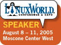

<table><tbody><tr><td>I really never thought I'd be sticking a picture of a penguin on my weblog, but here it is... Joined by <a href="/bmc">Bryan</a> and <a href="/eschrock">Eric</a>, I'll be speaking (and listening) at the <a href="http://www.linuxworldexpo.com/live/12/events/12SFO05A/conference/tracksessions//QMONYA04O6SS">OpenSolaris BoF</a> at <a href="http://www.linuxworldexpo.com/live/12/events/12SFO05A">LinuxWorld</a> (August 9, 5:30-7:00). We'll be talking about using and developing on OpenSolaris, how you can participate, and most likely comparing Solaris and Linux as well as giving the mandatory DTrace pitch. I expect it will be a little like the times I've been to <a href="http://bostondirtdogs.boston.com/Headline_Archives/2005/04/the_ring_2.html">Yankee</a> stadium in full <a href="http://bostondirtdogs.boston.com/Headline_Archives/arodpurse.jpg">Red</a> <a href="http://bostondirtdogs.boston.com/Headline_Archives/2004/10/sox_win_world_s.html">Sox</a> regalia.</td><td></td></tr></tbody></table>

* * *

Technorati Tags: [OpenSolaris](http://technorati.com/tag/OpenSolaris) [LinuxWorld](http://technorati.com/tag/LinuxWorld) [DTrace](http://technorati.com/tag/DTrace)
