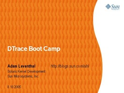

I just got back from an extended DTrace world tour -- Prague, Watford, London, San Francisco, Los Angeles, and San Diego. Along the way, I gave a couple of workshops on using DTrace. The slides are far from finished[\[1\]](#slides_story), but if you're learning DTrace, they might be a good place to start. The workshop is designed to take you through DTrace gradually and includes many examples and exercises.

If you have suggestions for how to improve the talk or content you'd like to see in there, please let me know. If you'd like some hints or solutions for the exercises, feel free to post a comment, mail me privately, or (probably the best) post a question to the [DTrace discussion forum](http://www.opensolaris.org/jive/forum.jspa?forumID=7) (or [subscribe](mailto:dtrace-discuss-subscribe@opensolaris.org) to it).

* * *

[\[1\]](#slides_story_ref) I first wrote these slides in a four hour marathon immedidately after a Sun [volleyball](http://blogs.sun.com/roller/page/roumen?entry=netbeans_volleyball_party) [tournament](http://blogs.sun.com/roller/page/lukas?entry=volleyball_tournament_kick_off) in Prague. After getting home around 10pm, I sat down, turned on the [Red Sox](http://bostondirtdogs.com/) game on [mlb.tv](http://mlb.tv), and cranked out slides until 2am. There are some places that definitely read like they were written a little too late at night...

Technorati tag: [DTrace](http://technorati.com/tag/DTrace)
