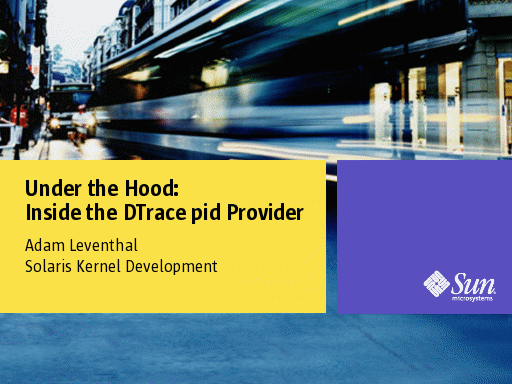

In the kernel group, we occasionally give presentations on interesting work we've been doing. Last week, I gave a talk on the implementation the DTrace pid provider, and -- in the spirit of community that the [OpenSolaris](http://opensolaris.org/) project has engendered -- I'm posting it on my blog:

[  
click to go to the presentation](http://dtrace.org/resources/ahl/img0.html)

In this presentation I go into the many details of the general technique for arbitrary instruction instrumentation, the implementation on SPARC, x86 and amd64 as well as the many pitfalls, caveats, tricks, and solutions. While I wouldn't say I go into excruciating details, it's probably falls just short. If you're interested at all in instrumentation or want to know more about the pid provider or are just a super nerd who enjoys reading about cool, low-level hackery, it's probably worth a read.

I've tried to augment it with some helpful commentary, but if something's confusing, vague or seems wrong, please let me know.

* * *

Technorati tag: [DTrace](http://technorati.com/tag/DTrace)
