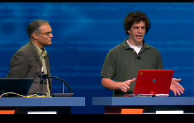
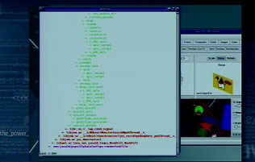

In case you missed the DTrace demo during the JavaOne keynote, you can view it in RealPlayer format [here](http://wcdata.sun.com/webcast/archives/VIP-1981). To skip to the DTrace stuff, jump 1:12:30 in. I haven't actually been able to bring myself to watch it -- I'm too self-conscious -- so feel free to comment on it. Things to keep in mind when watching: I can type better when I'm not in front of 7,000 people and I'm well aware that I need a hair cut.

 

That guy next to me is [John Loiacono](http://blogs.sun.com/roller/page/johnnyl) (not to be confused with [Laocoon](http://www.bluffton.edu/~sullivanm/laocoon/laocoon.html), the tragic figure of Roman epic).

* * *

Technorati Tags: [DTrace](http://technorati.com/tag/DTrace) [JavaOne](http://technorati.com/tag/JavaOne)
