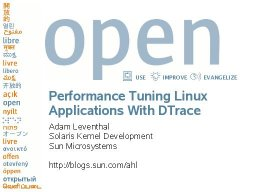

I gave a talk today at [SCALE 4X](http://www.socallinuxexpo.org/) describing how to use [DTrace](http://opensolaris.org/os/community/dtrace) to understand Linux applications by using [BrandZ](http://opensolaris.org/os/community/brandz). I admit I was a little leery about how a talk about a Solaris feature would go over at a Linux conference, but it was very well received. Here's my slide deck:

For more, check out [my blog post](http://dtrace.org/blogs/ahl/dtrace_for_linux) on the subject.

* * *

Technorati Tags: [DTrace](http://technorati.com/tag/DTrace) [BrandZ](http://technorati.com/tag/BrandZ)
