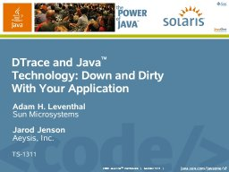

Jarod Jenson and I presented at JavaOne last week. If you're interested, here are the slides we used:

Admittedly, a pdf can't capture the scene of Jarod typing in DTrace commands while I futilely try to narrate, but you can run your own demos by checking out [this](/2005/06/27/open-sourcing-the-javaone-keynote/), [this](/2005/04/18/dtracing-java/), and [this](/2005/05/29/real-java-debugging-w-dtrace/).

* * *

Technorati Tags: [DTrace](http://technorati.com/tag/DTrace) [Java](http://technorati.com/tag/Java) [JavaOne](http://technorati.com/tag/JavaOne)
