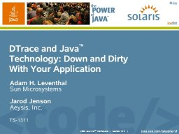

Jarod Jenson and I presented at JavaOne last week. If you're interested, here are the slides we used:

Admittedly, a pdf can't capture the scene of Jarod typing in DTrace commands while I futilely try to narrate, but you can run your own demos by checking out [this](http://dtrace.org/blogs/ahl/open_sourcing_the_javaone_keynote), [this](http://dtrace.org/blogs/ahl/dtracing_java), and [this](http://dtrace.org/blogs/ahl/java_debugging_w_dtrace).

* * *

Technorati Tags: [DTrace](http://technorati.com/tag/DTrace) [Java](http://technorati.com/tag/Java) [JavaOne](http://technorati.com/tag/JavaOne)
