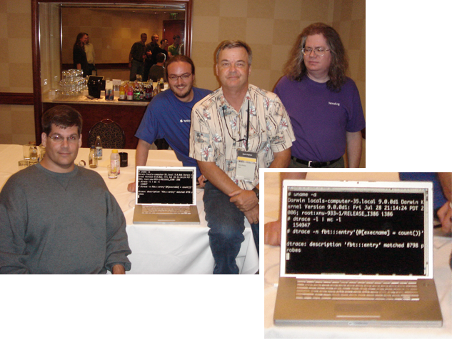
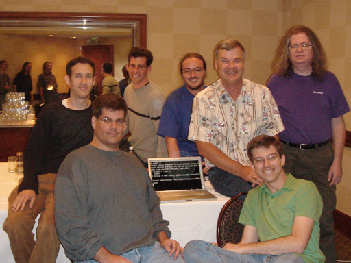

As [Bryan](http://blogs.sun.com/bmc) wrote, [Apple has ported DTrace to Mac OS X](http://blogs.sun.com/roller/page/bmc?entry=dtrace_on_mac_os_x). The Apple kernel team invited us to the WWDC today for the (albeit muted) announcement of their DTrace support, and then for a demo and dinner. It was surprisingly fun to play with DTrace on another OS, and it was a true pleasure to talk to the Apple guys who worked on the port. And it's my pleasure to introduce those engineers to the DTrace community at large:

 James McIlree, Tom Duffy, Steve Peters, Terry Lambert (DTrace on Mac OS X inset)

And here's team DTrace with our new friends at Apple:

Congratulations to the Apple team and to Mac OS X users. I'm installing the DTrace-enabled Mac OS X on my laptop right now -- something I've been wanting for a long time...

* * *

Technorati Tags: [DTrace](http://technorati.com/tag/DTrace) [Mac OS X](http://technorati.com/tag/MacOSX) [WWDC](http://technorati.com/tag/WWDC) [OpenSolaris](http://technorati.com/tag/OpenSolaris)
