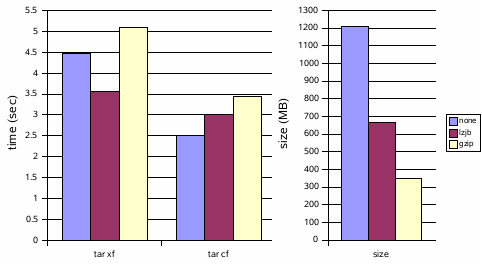

The other day I [posted about a prototype](http://dtrace.org/blogs/ahl/a_little_zfs_hack) I had created that adds a **gzip** compression algorithm to ZFS. ZFS already allows administrators to choose to compress filesystems using the [LZJB compression algorithm](http://en.wikipedia.org/wiki/LZJB). This prototype introduced a more effective -- albeit more computationally expensive -- alternative based on [zlib](http://www.zlib.net/).

As an arbitrary measure, I used tar(1) to create and expand archives of an ON (Solaris kernel) source tree on ZFS filesystems compressed with lzjb and gzip algorithms as well as on an uncompressed ZFS filesystem for reference:

Thanks for the feedback. I was curious if people would find this interesting and they do. As a result, I've decided to polish this wad up and integrate it into Solaris. I like Robert Milkowski's recommendation of options for different gzip levels, so I'll be implementing that. I'll also upgrade the kernel's version of zlib from 1.1.4 to 1.2.3 (the latest) for some compression performance improvements. I've decided (with some hand-wringing) to succumb to the requests for me to make these code modifications available. **This is not production quality. If anything goes wrong it's completely your problem/fault -- don't make me regret this.** Without further disclaimer: [pdf](http://dtrace.org/resources/ahl/zfs_gzip.pdf) [patch](http://dtrace.org/resources/ahl/zfs_gzip.patch)

In reply to some of the comments:

> _**UX-admin** One could choose between lzjb for day-to-day use, or bzip2 for heavily compressed, "archival" file systems (as we all know, bzip2 beats the living daylights out of gzip in terms of compression about 95-98% of the time)._
> 
> It may be that bzip2 is a better algorithm, but we already have (and need zlib) in the kernel, and I'm loath to add another algorithm
> 
> _**ivanvdb25** Hi, I was just wondering if the gzip compression has been enabled, does it give problems when an ZFS volume is created on an X86 system and afterwards imported on a Sun Sparc?_
> 
> That isn't a problem. Data can be moved from one architecture to another (and I'll be verifying that before I putback).
> 
> _**dennis** Are there any documents somewhere explaining the hooks of zfs and how to add features like this to zfs? Would be useful for developers who want to add features like filesystem-based encryption to it. Thanks for your great work!_
> 
> There aren't any documents exactly like that, but there's plenty of documentation in the code itself -- that's how I figured it out, and it wasn't too bad. The [ZFS source tour](http://www.opensolaris.org/os/community/zfs/source) will probably be helpful for figuring out the big picture.

**Update 3/22/2007:** This work was integrated into build 62 of onnv.

* * *

Technorati Tags: [ZFS](http://technorati.com/tag/ZFS) [OpenSolaris](http://technorati.com/tag/OpenSolaris)
