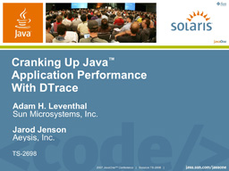

This year, [Jarod Jenson](http://www.sun.com/bigadmin/content/dtrace/blogs/jarod/) and I gave an updated version of our DTrace for Java (technology-based applications) talk:

[](http://dtrace.org/resources/ahl/dtrace_java_2007.pdf)

The biggest new feature that we demonstrated is the forthcoming **Java Statically-Defined Tracing (JSDT)** which will allow developers to embed stable probes in their code as we can do today in the kernel with SDT probes and in C and C++ applications with [USDT probes](http://dtrace.org/blogs/ahl/user_land_tracing_gets_better). While you can already trace Java applications (and C and C++ applications), static probes let the developer embed stable and semantically rich points of instrumentation that allow the user to examine the application without needing to understand its implementation. The Java version of this is so new I had literally never seen it until Jarod gave a demonstration during our talk. The basic idea is that you can define a new probe by constructing a USDTProbe instance specifying the provider, function, probe name, and argument signature:

```
sun.dtrace.USDTProbe myprobe = new sun.dtrace.USDTProbe("myprovider", "myfunc", "myprobe", "ssl");

```

To fire the probe, you invoke the `Call()` method on the instance, and pass in the appropriate arguments.

Attendance was great, and we talked to a lot of people who had attended last year and had been getting mileage out of DTrace for Java. Next year, we're hoping to give the updated version of this talk on Tuesday (rather than Friday for once) and invite people to bring in their applications for a tune-up; we'll present the results in a case study-focussed talk on Friday.
