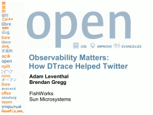

I just got back from [OSCON](http://conferences.oreillynet.com/os2007/), a conference on Open Source that O'Reilly hosts in Portland annually. The conference offered some interesting content and side-shows with some notable highlights (more on those in the next few days). [Brendan](http://blogs.sun.com/brendan) and I gave a presentation on how [a](http://blogs.sun.com/bmc) [crew](http://blogs.sun.com/mws) [from](http://blogs.sun.com/eschrock) [Sun](http://blogs.sun.com/wesolows) dropped in on [Twitter](http://twitter.com/) to help them use [DTrace](http://www.opensolaris.org/os/community/dtrace/) to discover some nasty performance problems.

Here's [the presentation](http://dtrace.org/resources/ahl/dtrace_ruby_oscon_2007.pdf) along with [the D scripts and load generators](http://dtrace.org/resources/ahl/dtrace_ruby_oscon_2007.tar) we used for the talk.
