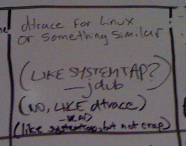
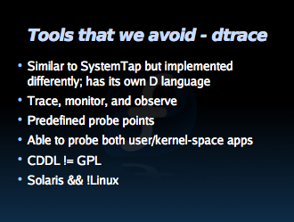

**Update 8/6/2007:** Those of you interested in this entry may also want to check out [my next entry](http://dtrace.org/blogs/ahl/what_if_machine_dtrace_port) on the legality of a hypothetical port of DTrace to Linux.

 Tools We Wish We Had -- OSCON 7/26/2007

Last week at [OSCON](http://conferences.oreillynet.com/os2007/) someone set up a whiteboard with the heading "Tools We Wish We Had". People added entries (wiki-style); this one in particular caught my eye:

dtrace for Linux or something similar

(LIKE SYSTEMTAP?) - jdub (NO, LIKE dtrace) - VLAD (like systemtap, but not crap)

### DTrace

So what exactly were they asking for? DTrace is the tool developers and sysadmins have always needed -- whether they knew it or not -- but weren't able to express in words let alone code. Most simply (and least humbly) DTrace lets you express a question about nearly any aspect of the system and get the answer in a simple and concise form. And -- this is important -- you can do it **safely** on machines running in **production** as well as in development. With DTrace, you can look at the highest level software such as Ruby (as was the subject of my talk at OSCON) through all the layers of the software stack down to the lowest level kernel facilities such as I/O and scheduling. This systemic scope, production focus, and arbitrary flexibility are completely new, and provide literally unprecedented observability into complex software systems. We're scientists, we're detectives -- DTrace lets us form hypotheses, and prove or disprove them in an instant until we've come to an understanding of the problem, until we've solved the crime. Of course anyone using Linux would love a tool _like_ that -- especially because DTrace is already available on Mac OS X, Solaris, and FreeBSD.

### SystemTap

So is SystemTap like DTrace? To understand SystemTap, it's worth touching on the history of DTrace: [Bryan](http://blogs.sun.com/bmc) cut the first code for DTrace in October of 2001; [Mike](http://blogs.sun.com/mws) tagged in moments later, and I joined up after a bit. In September of 2003 we integrated DTrace into Solaris 10 which first became available to customers in November of 2003 and formally shipped and was open-sourced in January of 2005. Almost instantly we started to see the impact in the field. In terms of performance, Solaris has strong points and weak points; with DTrace we were suddenly able to understand where those bottlenecks were on customer systems and beat out other vendors by improving our performance -- not in weeks or months, but literally in a few hours. Now, I'm not saying that DTrace was the silver bullet by which all enemies were slain -- that's clearly not the case -- but it was turning some heads and winning some deals.

Now, this bit involves some hearsay and conjecture[\[1\]](#hutz), but apparently some managers of significance at Red Hat, IBM, and Intel started to take note. "We've got to do something about this DTrace," one of them undoubtedly said with a snarl (as an underling dragged off the fresh corpse of an unlucky messenger). SystemTap was a direct reaction to the results we were achieving with DTrace -- not to DTrace as an innovative technology.

When the project started in January of 2005, early discussion by the SystemTap team referred to "inspiration" that they derived from DTrace. They had a mandate to come up with an equivalent, so I assumed that they had spent the time to truly _understand_ DTrace: to come up with an equivalent for DTrace -- or really to duplicate any technology -- the first step is to understand what it is completely. From day one, DTrace was designed to be used on **mission critical systems**, to always be safe, to induce no overhead when not in use, to allow for **arbitrary data gathering**, and to have **systemic scope** from the kernel to user-land and on up the stack into higher level languages. Those fundamental constraints led to some important, and non-obvious design decisions (e.g. our own language "D", a micro virtual machine, conservative probe point selection).

  
SystemTap -- the "Sorny" of dynamic tracing

Instead of taking the time to understand DTrace, and instead of using it and scouring the documentation, SystemTap charged ahead, completely missing the boat on safety with an architecture which is nearly impossible to secure (e.g. running a SystemTap script drops in a generated kernel module). Truly systemic scope remains an elusive goal as they're only toe-deep in user-land (forget about Ruby, Java, python, etc). And innovations in DTrace such as scalable data aggregation and speculative tracing are replicated poorly if at all. By failing to examine DTrace, and by rushing to have some sort of response, SystemTap isn't like DTrace: it's a knockoff.

Amusingly, in an apparent attempt to salvage their self-respect, the SystemTap team later renounced their inspiration. Despite frequent mentions of DTrace in their [early meetings and email](http://sourceware.org/ml/systemtap/2005-q2/msg00180.html), it turns out, [DTrace didn't actually inspire them much at all](http://sourceware.org/ml/systemtap-cvs/2006-q4/msg00068.html):

```
CVSROOT:	/cvs/systemtap
Module name:	src
Changes by:	kenistoj@sourceware.org	2006-11-02 23:03:09
Modified files:
.              : stap.1.in
Log message:
Removed refs to dtrace, to which we were giving undue credit in terms of
"inspiration."
```

 you're not my real dad! **<slam>**

### Bad Artists Copy...

So uninspired was the SystemTap team by DTrace, that they don't even advocate its use according to [a presentation on profiling applications](http://sourceware.org/systemtap/wiki/LCA2007) ("Tools that we avoid - dtrace \[sic\]"). In that same presentation there's an example of a SystemTap-based tool called udpstat.stp:

```
$ udpstat.stp
UDP_out  UDP_outErr  UDP_in  UDP_inErr  UDP_noPort
0           0       0          0           0
0           0       0          0           0
4           0       0          0           0
5           0       0          0           0
5           0       0          0           0
```

... whose output was likely "inspired" by udpstat.d -- part of the DTraceToolkit by [Brendan Gregg](http://www.brendangregg.com/):

```
# udpstat.d
UDP_out  UDP_outErr   UDP_in  UDP_inErr  UDP_noPort
0           0        0          0           1
0           0        0          0           2
0           0        0          0           0
1165           0        2          0           0
```

In another act of imitation reminiscent of liberal teenage borrowing from wikipedia, take a look at [Eugene Teo's](http://eugeneteo.livejournal.com/8638.html) slides from Red Hat Summit 2007 as compared with Brendan's [DTrace Topics Intro wiki](http://www.solarisinternals.com/wiki/index.php/DTrace_Topics_Intro) (the former apparently being generated by applying a sed script to the latter). For example:

What isn’t SystemTap

- SystemTap isn’t sentient; requires user thinking process
- SystemTap isn’t a replacement for any existing tools

What isn't DTrace

- DTrace isn't a replacement for kstat or SMNP
    - kstat already provides inexpensive long term monitoring.
- DTrace isn't sentient, it needs to borrow your brain to do the thinking
- DTrace isn't “dTrace”

### ... Great Artists Steal

While some have chosen the knockoff route, others have taken the time to analyze what DTrace does, understood the need, and decided that the best DTrace equivalent would be... DTrace. As with the rest of Solaris, DTrace is open source so developers and customers are excited about porting. Just a few days ago there were a couple of interesting blog posts ([here](http://rajeev.name/blog/2007/07/30/would-dtrace-make-sense-on-ontap/) and [here](http://www.vmunix.com/mark/blog/archives/2007/07/30/dtrace-for-netapp-please/)) by users of ONTAP, NetApp's appliance OS, not for a DTrace equivalent, but for a port of DTrace itself.

DTrace is already available in the developer builds of Mac OS X 10.5, and there's a functional port for FreeBSD. I don't think it's a stretch to say that DTrace itself is becoming the measuring stick -- **if not the standard**. Why reinvent the wheel when you can port it?

### Time For Standards

At the end of my talk last week someone asked if there was a port of DTrace to Linux (not entirely surprising since OSCON has a big Linux user contingent). I told him to ask the Linux bigwigs (several of them were also at the conference); after all, we didn't do the port to Mac OS X, and we didn't do the port to FreeBSD. We did extend our help to [those developers](http://dtrace.org/blogs/ahl/dtrace_on_mac_os_x), and they, in turn, helped DTrace by growing the community and through direct contributions[\[2\]](#mcilree).

We love to see DTrace on other operating systems, and we're happy to help.

So to the pretenders: enough already with the knockoffs. [Your users want DTrace](http://softwareblogs.intel.com/2007/05/15/why-linux-people-lust-after-dtrace/), you obviously want what DTrace offers, and the entire DTrace team and community are eager to help. I'm sure there's been some FUD about license incompatibilities, but it's certainly Sun's position (as [stated by Sun's CEO Jonathan Schwartz](http://radar.oreilly.com/archives/2005/11/oscon_jonathan_schwartz_interv.html) at OSCON 2005) that such a port wouldn't violate the OpenSolaris license. And even closed-source kernel components are tolerated from the likes of Symantec (nee Veritas) and nVidia. Linux has been a champion of standards, eschewing proprietary solutions for free and open standards. DTrace might not _yet_ be a standard, but a DTrace knockoff never will be.

\[1\] ... those are _kinds_ of evidence  
\[2\] including [posts on the DTrace discussion forum](http://www.opensolaris.org/jive/thread.jspa?threadID=36296&tstart=0) comprehensible only to me and James
