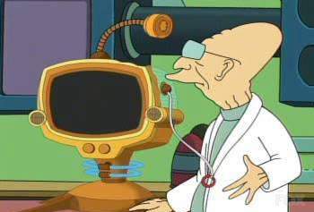

  
What if there were a port of DTrace to Linux?

What if there were a port of DTrace to Linux: could such a thing be done without violating either the GPL or CDDL? Read on before you jump right to the [comments section](http://dtrace.org/blogs/ahl/what_if_machine_dtrace_port#comments) to add your two cents.

In [my last post](http://dtrace.org/blogs/ahl/dtrace_knockoffs), I discussed an attempt to create a DTrace knockoff in Linux, and suggested that a port might be possible. Naively, I hoped that comments would [examine the heart of my argument](http://www.lildude.co.uk/2007/08/gpl-vs-cddl-again/), [bemoan the apparent NIH](http://www.c0t0d0s0.eu/archives/3371-DTrace,-systemtap-and-a-brief-history-of-NIH.html) in the Linux knockoff, [regret the misappropriation of slideware](http://eugeneteo.livejournal.com/8911.html), and maybe discuss some [technical details](http://elastic.org/~fche/blog2/archive/2007/08/03/systemtap_safety) -- anything but [dwell on licensing issues](http://www.crypticide.com/dropsafe/article/2100).

For this post, I welcome the debate. Open source licenses are important, and the choice can have a profound impact on the success of the software and the community. But conversations comparing the excruciating minutia of one license and another are exhausting, and usually become pointless in a hurry. Having a concrete subject might lead to a productive conversation.

### DTrace Port Details

Just for the sake of discussion, let's say that [Google](http://google.com) decide to port DTrace to Linux (everyone loves Google, right?). This isn't so far fetched: Google uses Linux internally, maybe they're using SystemTap, maybe they're not happy with it, but they definitely (probably) care about dynamic tracing (just like all good system administrators and developers should). So suppose some engineers at Google take the following (purely hypothetical) steps:

### Kernel Hooks

DTrace has a little bit of functionality that lives in the core kernel. The code to deal with [invalid memory accesses](http://cvs.opensolaris.org/source/xref/onnv/onnv-gate/usr/src/uts/i86pc/ml/locore.s#1205), [some glue](http://cvs.opensolaris.org/source/xref/onnv/onnv-gate/usr/src/uts/common/krtld/kobj.c#3069) between the kernel's dynamic linker and some of the DTrace instrumentation providers, and some [simple, low-level routines](http://cvs.opensolaris.org/source/xref/onnv/onnv-gate/usr/src/uts/i86pc/os/dtrace_subr.c#47) cover the bulk of it. My guess is there are about 1500 lines of code all told: not trivial, but hardly insurmountable. Google implements these facilities in a manner designed to allow the results to be licensed under the GPL. For example, I think it would be sufficient for someone to draft a specification and for someone else to implement it so long as the person implementing it hadn't seen the CDDL version. Google then posts the patch publically.

### DTrace Kernel Modules

The other DTrace kernel components are divided into several loadable kernel modules. There's the main DTrace module and then the instrumentation provider modules that connect to the core framework through an internal interface. These constitute the vast majority of the in-kernel DTrace code. Google modifies these to use slightly different interfaces (e.g. `mutex\_enter()` becomes `mutex\_lock()`); the final result is a collection of kernel modules still licensed under the CDDL. Of course, Google posts any modifications to CDDL files.

### DTrace Libraries and Commands

It wouldn't happen for free, but the DTrace user-land components could just be directly ported. I don't believe there are any legal issues here.

So let's say that this is Google's DTrace port: their own hacked up kernel, some kernel modules operating under a non-GPL license, and some user-land components (also under a non-GPL license, but, again, I don't think that matters). Now some questions:

### 1\. Legal To Run?

If Google assembled such a system, would it be legal to run on a development desktop machine? It seems to violate the GPL no more than, say, the nVidia drivers (which are presumably also running on that same desktop). What if Google installed the port on a customer-facing machine? Are there any additional legal complications there? My vote: legit.

### 2\. Legal To Distribute?

Google distributes the Linux kernel patch (so that others can construct an identical kernel), and elsewhere they distribute the Linux-ready DTrace modules (in binary or source form): would that violate either license? It seems that it would potentially violate the GPL if a full system with both components were distributed together, but distributed individually it would certainly be fine. My vote: legit, but straying into a bit of a gray area.

### 3\. Patch Accepted?

I'm really just putting this here for completeness. Google then submits the changes to the Linux kernel and tries to get them accepted upstream. There seems to be a precedent for the Linux kernel not accepting code that's there merely to support non-GPL kernel modules, so I doubt this would fly. My vote: not gonna happen.

### 4\. No Source?

What if Google didn't supply the source code to either component, and didn't distribute any of it externally? My vote: legal, but morally bankrupt.

### You Make The Call

So what do you think? Note that I'm not asking if it would be "good", and I'm not concluding that this would obviate the need for direct support for a native dynamic tracing framework in the Linux kernel. What I want to know is whether or not this DTrace port to Linux would be legal (and why)? If not, what would happen to poor Google (e.g. would FSF ninjas storm the Googleplex)?

**If you care to comment**, please include some brief statement about your legal expertise. I for one am not a lawyer, have no legal background, have read both the GPL and CDDL and have a basic understanding of both, but claim to be an authority in neither. If you don't include some information with regard to that, I may delete your comment.
