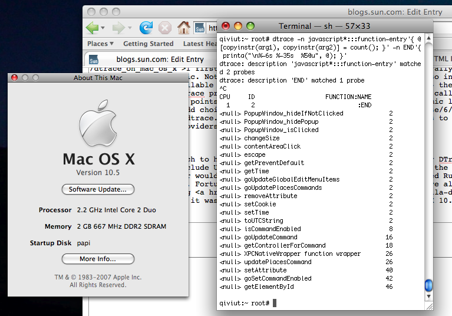

It's been more than a year since [I first saw DTrace on Mac OS X](http://dtrace.org/blogs/ahl/dtrace_on_mac_os_x), and now it's at last generally available to the public. Not only did Apple port DTrace, but they've also included a bunch of USDT providers. Perl, Python, Ruby -- they all ship in Leopard with built-in DTrace probes that allow developers to observe function calls, object allocation, and other points of interest from the perspective of that dynamic language. Apple did make some odd choices (e.g. no [Java provider](http://java.sun.com/javase/6/docs/technotes/guides/vm/dtrace.html), spurious modifications to the publicly available providers, a different build process), but on the whole it's very impressive.

Perhaps it was too much to hope for, but with Apple's obvious affection for DTrace I thought they might include USDT probes for Safari. Specifically, probes in the JavaScript interpreter would empower developers in the same way they enabled Ruby, Perl, and Python developers. Fortunately, the folks at the Mozilla Foundation have already done the heavy lifting [for Firefox](http://www.opensolaris.org/os/project/mozilla-dtrace/) -- it was just a matter of compiling Firefox on Mac OS X 10.5 with DTrace enabled:

There were some minor modifications I had to make to the Firefox build process to get everything working, but it wasn't too tricky. I'll try to get a patch submitted this week, and then Firefox will have the same probes on Mac OS X that it does -- thanks to [Brendan's early efforts](http://blogs.sun.com/brendan/entry/dtrace_meets_javascript) -- on Solaris. JavaScript developers take note: this is good news.
