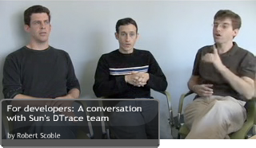

Robert Scoble was kind enough to [interview us](http://www.podtech.net/scobleshow/technology/1557/for-developers-a-conversation-with-suns-dtrace-team) last week for the ScobleShow. Robert pretty much let us riff continuously for half an hour -- we clearly haven't been getting to talk about DTrace enough lately. I thought he would trim it down a bit, but like a scene from [Hard Boiled](http://en.wikipedia.org/wiki/Hard_Boiled#Long_take), it's all there.

This picture captures my favorite moment (around 16:23) during the interview as the three of us try to formulate a connection between DTrace and green computing...

... and this is as good a time as any to [plug the talk](http://conferences.oreillynet.com/cs/os2007/view/e_sess/14668) Brendan and I will be giving at the end of the month at [OSCON](http://conferences.oreillynet.com/os2007/). We'll be talk about how team DTrace was able to solve some nasty Ruby scalability problems at Twitter; it's in the Ruby track, but the principles apply for analysis of performance problems in all languages.
