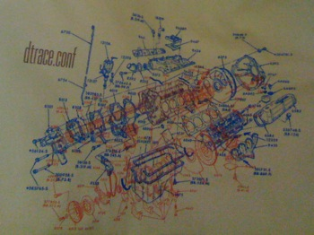

This originally was going to be a post-mortem on dtrace.conf, but so much time has passed, that I doubt it qualifies anymore. Back in March, we held the first ever DTrace (un)conference, and I hope I speak for all involved when I declare it a terrific success. And our t-shirts (logo pictured) were, frankly, bomb. Here are some fairly random impressions from the day:

Notes on the demographics at dtrace.conf: Macs were the most prevalent laptops by quite a wide margin, and a ton of demos were done under VMware for the Mac. There were a handful of dvorak users who far outnumbered the Esperanto speakers (there were none) despite apparently similarly rationales. There were, _by a wide margin,_ more live demonstrations that I'd seen during a day of technical talks; there were probably fewer individual slides than demos -- exactly what we had in mind.

My favorite session brought the authors of the three DTrace ports to the front of the room to talk about porting, and answer questions (mostly from the DTrace team). I was excited that they agreed to work together on a wiki and on a DTrace porting project. Both would be great for new ports and for building a repository that could integrate all the ports into a single repository. I just have to see if I can get them to follow through now several weeks removed from the DTrace love-in...

Also particularly interesting were a demonstration of a DTrace-enabled Adobe Air prototype and the _very_ clever mechanism behind the Java group's plan for native Java static probes (JSDT). Essentially, they're using the same technique as normal USDT, but dynamically generating the tracing description structures and sending them down to the kernel (slick).

The most interesting discussion resulted from [Keith's](http://x86vmm.blogspot.com/) presentation of vprobes -- a DTrace... um... inspired facility in VMware. While it is necessary to place a unified tracing mechanism at the lowest level of software abstraction (in DTrace's case, the kernel), it may also make sense to embed collaborating tracing frameworks at other levels of the stack. For example, the JVM could include a micro-DTrace which communicated with DTrace in the kernel as needed. This would both improve enabled performance (not a primary focus of DTrace), and allow for better domain-specific instrumentation and expression. I'll be interested to see how vprobes executes on this idea.

Requests from the DTrace community:

- more providers ala the recent [nfs](http://wikis.sun.com/display/DTrace/nfsv4+Provider) and proposed [ip](http://wikis.sun.com/display/DTrace/ip+Provider) providers
- consistency between providers (kudos to those sending their providers to the DTrace discussion list for review)
- better compatibility with the ports -- several people observed that while they love the port to Leopard, Apple's spurious exclusion of the `\-G` option created tricky conflicts

[Ben](http://www.cuddletech.com/blog/) was kind enough to video the entire day. We should have the footage publicly available in about a week. Thanks to all who participated; several recent projects have already gotten me excited for dtrace.conf(09).
