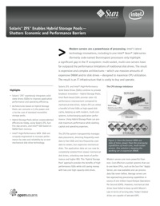

I've written about Hybrid Storage Pools (HSPs) here [several](http://dtrace.org/blogs/ahl/flash_hybrid_pools_and_future) [times](http://dtrace.org/blogs/ahl/hybrid_storage_pools_the_l2arc) as well as in an article that appeared in the ACM's [Queue](http://www.acmqueue.org/modules.php?name=Content&pa=showpage&pid=553) and [CACM](http://dtrace.org/blogs/ahl/hybrid_storage_pools_in_cacm) publications. Now the folks in Sun marketing on the occasion of our joint SSD announcement with Intel have distilled that down to a [four page glossy](http://www.sun.com/x64/intel/zfs_solution_brief.pdf), and they've done a terrific job. I suggest taking a look.

The concept behind the HSP is a simple one: combine disk, flash, and DRAM into a single coherent and seamless data store that makes optimal use of each component and its economic niche. The mechanics of how this happens required innovation from the Fishworks and ZFS groups to integrate flash as a new tier in storage hierarchy for use in our forthcoming line of storage products. The impact of the HSP is pure economics: it delivers superior capacity and performance for a lower cost and smaller power footprint. That's the marketing pitch; if you want to wade into the details, check out the links above.
