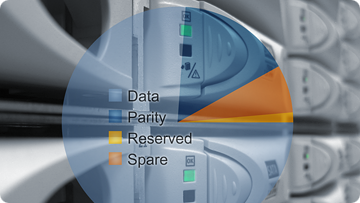

The Sun Storage 7410 is our expandable storage appliance that can be hooked up to anywhere from one and twelve JBODs with 24 1TB disks. With all those disks we provide the several different options for how to arrange them into your storage pool: double-parity RAID-Z, wide-strip double-parity RAID-Z, mirror, striped, and single-parity RAID-Z with narrow stripes. Each of these options has a different mix of availability, performance, and capacity that are described both in the UI and in the [installation documentation](http://docs.sun.com/source/820-3757-11/appendix.html#50417677_99389). With the wide array of supported configurations, it can be hard to know how much usable space each will support.

To address this, I wrote a python script that presents a hypothetical hardware configuration to an appliance and reports back the available options. We use the logic on the appliance itself to ensure that the results are completely accurate as the same algorithms would be applied as when then the physical pallet of hardware shows up. This, of course, requires you to have an appliance available to query — fortunately, you can run a [virtual instance](http://www.sun.com/storage/disk_systems/unified_storage/resources.jsp) of the appliance on your laptop.

You can download the `sizecalc.py` [here](http://dtrace.org/resources/ahl/sizecalc.py); you'll need python installed on the system where you run it. Note that the script uses XML-RPC to interact with the appliance, and consequently it relies on unstable interfaces that are subject to change. Others are welcome to interact with the appliance at the XML-RPC layer, but note that it's unstable and unsupported. If you're interested in scripting the appliance, take a look at [Bryan's recent post](http://blogs.sun.com/bmc/entry/on_modalities_and_misadventures). Feel free to post comments here if you have questions, but there's no support for the script, implied, explicit, unofficial or otherwise.

Running the script by itself produces a usage help message:

```
$ ./sizecalc.py
usage: ./sizecalc.py [ -h <half jbod count> ] <appliance name or address>
<root password> <jbod count>

```

Remember that you need a Sun Storage 7000 appliance (even a virtual one) to execute the capacity calculation. In this case, I'll specify a physical appliance running in our lab, and I'll start with a single JBOD (note that I've redacted the root password, but of course you'll need to type in the actual root password for your appliance):

```
$ ./sizecalc.py catfish ***** 1
type            NSPF   width  spares   data drives     capacity (TB)
raidz2         False      11       2            22                18
raidz2 wide    False      23       1            23                21
mirror         False       2       2            22                11
stripe         False       0       0            24                24
raidz1         False       4       4            20                15

```

Note that with only one JBOD no configurations support NSPF (No Single Point of Failure) since that one JBOD is always a single point of failure. If we go up to three JBODs, we'll see that we have a few more options:

```
$ ./sizecalc.py catfish ***** 3
type            NSPF   width  spares   data drives     capacity (TB)
raidz2         False      13       7            65                55
raidz2          True       6       6            66                44
raidz2 wide    False      34       4            68                64
raidz2 wide     True       6       6            66                44
mirror         False       2       4            68                34
mirror          True       2       4            68                34
stripe         False       0       0            72                72
raidz1         False       4       4            68                51

```

In this case we have to give up a bunch of capacity in order to attain NSPF. Now let's look at the largest configuration we support today with twelve JBODs:

```
$ ./sizecalc.py catfish ***** 12
type            NSPF   width  spares   data drives     capacity (TB)
raidz2         False      14       8           280               240
raidz2          True      14       8           280               240
raidz2 wide    False      47       6           282               270
raidz2 wide     True      20       8           280               252
mirror         False       2       4           284               142
mirror          True       2       4           284               142
stripe         False       0       0           288               288
raidz1         False       4       4           284               213
raidz1          True       4       4           284               213

```

The size calculator also allows you to model a system with Logzilla devices, write-optimized flash devices that form a key part of the [Hybrid Storage Pool](http://dtrace.org/blogs/ahl/hybrid_storage_pools_in_cacm). After you specify the number of JBODs in the configuration, you can include a list of how many Logzillas are in each JBOD. For example, the following invocation models twelve JBODs with four Logzillas in the first 2 JBODs:

```
$ ./sizecalc.py catfish ***** 12 4 4
type            NSPF   width  spares   data drives     capacity (TB)
raidz2         False      13       7           273               231
raidz2          True      13       7           273               231
raidz2 wide    False      55       5           275               265
raidz2 wide     True      23       4           276               252
mirror         False       2       4           276               138
mirror          True       2       4           276               138
stripe         False       0       0           280               280
raidz1         False       4       4           276               207
raidz1          True       4       4           276               207

```

A very common area of confusion has been how to size Sun Storage 7410 systems, and the relationship between the physical storage and the delivered capacity. I hope that this little tool will help to answer those questions. A side benefit should be still more interest in the [virtual version of the appliance](http://www.sun.com/storage/disk_systems/unified_storage/resources.jsp) — a subject I've been meaning to post about so stay tuned.

**Update December 14, 2008:** A couple of folks requested that the script allow for modeling half-JBOD allocations because the 7410 allows you to split JBODs between heads in a cluster. To accommodate this, I've added a `\-h` option that takes as its parameter the number of half JBODs. For example:

```
$ ./sizecalc.py -h 12 192.168.18.134 ***** 0
type            NSPF   width  spares   data drives     capacity (TB)
raidz2         False      14       4           140               120
raidz2          True      14       4           140               120
raidz2 wide    False      35       4           140               132
raidz2 wide     True      20       4           140               126
mirror         False       2       4           140                70
mirror          True       2       4           140                70
stripe         False       0       0           144               144
raidz1         False       4       4           140               105
raidz1          True       4       4           140               105

```

**Update February 4, 2009:** [Ryan Matthews](http://blogs.sun.com/rdm) and I [collaborated](http://blogs.sun.com/rdm/entry/enhancing_the_size_calculator) on a new version of the size calculator that now lists the raw space available in TB (decimal as quoted by drive manufacturers for example) as well as the usable space in [TiB](http://en.wikipedia.org/wiki/Tebibyte) (binary as reported by many system tools). The latter also takes account of the sliver (1/64th) reserved by ZFS:

```
$ ./sizecalc.py 192.168.18.134 ***** 12
type          NSPF  width spares  data drives       raw (TB)   usable (TiB)
raidz2       False     14      8          280         240.00         214.87
raidz2        True     14      8          280         240.00         214.87
raidz2 wide  False     47      6          282         270.00         241.73
raidz2 wide   True     20      8          280         252.00         225.61
mirror       False      2      4          284         142.00         127.13
mirror        True      2      4          284         142.00         127.13
stripe       False      0      0          288         288.00         257.84
raidz1       False      4      4          284         213.00         190.70
raidz1        True      4      4          284         213.00         190.70

```

**Update June 17, 2009:** [Ryan Matthews](http://blogs.sun.com/rdm) with help from [has again](http://blogs.sun.com/eschrock) [revised the size calculator](http://blogs.sun.com/rdm/entry/2009_q2_update_for_size) to model both adding expansion JBODs and to account for the [now expandable Sun Storage 7210](http://blogs.sun.com/eschrock/entry/sun_storage_7210_expansion). Take a look at [Ryan's post](http://blogs.sun.com/rdm/entry/2009_q2_update_for_size) for usage information. Here's an example of the output:

```
$ ./sizecalc.py 172.16.131.131 *** 1 h1 add 1 h add 1
Sun Storage 7000 Size Calculator Version 2009.Q2
type          NSPF  width spares  data drives       raw (TB)   usable (TiB)
mirror       False      2      5           42          21.00          18.80
raidz1       False      4     11           36          27.00          24.17
raidz2       False  10-11      4           43          35.00          31.33
raidz2 wide  False  10-23      3           44          38.00          34.02
stripe       False      0      0           47          47.00          42.08

```

**Update September 16, 2009:** [Ryan Matthews](http://blogs.sun.com/rdm) updated the size calculator for the 2009.Q3 release. The update includes the new triple-parity RAID wide stripe and three-way mirror profiles:

```
$ ./sizecalc.py boga *** 4
Sun Storage 7000 Size Calculator Version 2009.Q3
type          NSPF  width spares  data drives       raw (TB)   usable (TiB)
mirror       False      2      4           92          46.00          41.18
mirror        True      2      4           92          46.00          41.18
mirror3      False      3      6           90          30.00          26.86
mirror3       True      3      6           90          30.00          26.86
raidz1       False      4      4           92          69.00          61.77
raidz1        True      4      4           92          69.00          61.77
raidz2       False     13      5           91          77.00          68.94
raidz2        True      8      8           88          66.00          59.09
raidz2 wide  False     46      4           92          88.00          78.78
raidz2 wide   True      8      8           88          66.00          59.09
raidz3 wide  False     46      4           92          86.00          76.99
raidz3 wide   True     11      8           88          64.00          57.30
stripe       False      0      0           96          96.00          85.95
** As of 2009.Q3, the raidz2 wide profile has been deprecated.
** New configurations should use the raidz3 wide profile.

```
