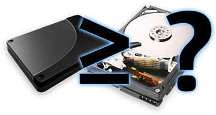

The debate, calmly waged, on the best use of flash in the enterprise can be summarized as whether flash should be a replacement for disk, acting as primary storage, or it should be regarded as a new, and complementary tier in the storage hierarchy, acting as a massive read cache. The market leaders in storage have weighed in the issue, and have declared incontrovertibly that, yes, **both** are the right answer, but there's some bias underlying that equanimity. Chuck Hollis, EMC's Global Marketing CTO, writes, that "[flash as cache will eventually become less interesting as part of the overall discussion... Flash as storage? Well, that's going to be really interesting.](http://chucksblog.emc.com/chucks_blog/2008/11/back-to-flash-again.html)" Standing boldly with a foot in each camp, Dave Hitz, founder and EVP at Netapp, thinks that "[Flash is too expensive to replace disk right away, so first we'll see a new generation of storage systems that combine the two: flash for performance and disk for capacity.](http://blogs.netapp.com/dave/2008/11/disk-is-the-new.html)" So what are these guys really talking about, what does the landscape look like, and where does Sun fit in all this?

### Flash as primary storage (a.k.a. tier 0)

Integrating flash efficiently into a storage system isn't obvious; the simplest way is as a direct replacement for disks. This is why most of the flash we use today in enterprise systems comes in units that look and act just like hard drives: SSDs are designed to be drop in replacements. Now, a flash SSD is quite different than a hard drive — rather than a servo spinning platters while a head chatters back and forth, an SSD has floating gates arranged in blocks... actually it's probably simpler to list what they have in common, and that's just the form factor and interface (SATA, SAS, FC). Hard drives have all kind of properties that don't make sense in the world of SSDs (e.g. I've seen an SSD that reports it's RPM telemetry as **1**), and SSDs have their own quirks with no direct analog (read/write asymmetry, limited write cycles, etc). SSD venders, however, manage to pound these round pegs into their square holes, and produce something that can stand in for an existing hard drive. Array vendors are all too happy to attain buzzword compliance by stuffing these SSDs into their products.

The trouble with HSM is the burden of the M.

Storage vendors already know how to deal with a caste system for disks: they striate them in layers with fast, expensive 15K RPM disks as tier 1, and slower, cheaper disks filling out the chain down to tape. What to do with these faster, more expensive disks? Tier-0 of course! An astute Netapp blogger asks, "[when the industry comes up with something even faster... are we going to have tier -1](http://blogs.netapp.com/shadeofblue/2008/11/both-disk-and-c.html)" — great question. What's wrong with that approach? Nothing. It works; it's simple; and we (the computing industry) basically know how to manage a bunch of tiers of storage with something called [hierarchical storage management](http://en.wikipedia.org/wiki/Hierarchical_storage_management). The trouble with HSM is the burden of the M. This solution kicks the problem down the road, leaving administrators to figure out where to put data, what applications should have priority, and when to migrate data.

### Flash as a cache

The other school of thought around flash is to use it not as a replacement for hard drives, but rather as a massive cache for reading frequently accessed data. As I wrote back in June for [CACM](http://cacm.acm.org/), "[this new flash tier can be thought of as a radical form of hierarchical storage management (HSM) without the need for explicit management.](http://dtrace.org/blogs/ahl/flash_hybrid_pools_and_future) Tersely, HSM without the M. This idea forms a major component of what we at Sun are calling the [Hybrid Storage Pool (HSP)](http://dtrace.org/blogs/ahl/hybrid_storage_pools_in_cacm), a mechanism for integrating flash with disk and DRAM to form a new, and — [I argue](http://blogs.sun.com/fishworks/resource/CEC08/fishworks_hsp.pdf) — superior storage solution.

Let's set aside the specifics of how we implement the HSP in [ZFS](http://opensolaris.org/os/community/zfs/) — you can read about that [elsewhere](http://www.acmqueue.com/modules.php?name=Content&pa=showpage&pid=553). Rather, I'll compare the use of flash as a cache to flash as a replacement for disk independent of any specific solution.

### The case for cache

It's easy to see why using flash as primary storage is attractive. Flash is faster than the fastest disks by at least a factor of 10 for writes and a factor of 100 for reads measured in IOPS. Replacing disks with flash though isn't without nuance; there are several inhibitors, primary among them is cost. The cost of flash continues to drop, but it's still much more expensive than cheap disks, and will continue to be for quite awhile. With flash as primary storage, you still need data redundancy — SSDs can and do fail — and while we could use RAID with single- or double-device redundancy, that would cleave the available IOPS by a factor of the stripe width. The reason to migrate to flash is for performance so it wouldn't make much sense to hang a the majority of that performance back with RAID. The remaining option, therefore, is to mirror SSDs whereby the already high cost is doubled.

It's hard to argue with results, all-flash solutions do rip. If money were no object that may well be the best solution (but if cost truly wasn't a factor, everyone would strap batteries to DRAM and call it a day).

Can flash as a cache do better? Say we need to store a 50TB of data. With an all-flash pool, we'll need to buy SSDs that can hold roughly 100TB of data if we want to mirror for optimal performance, and maybe 60TB if we're willing to accept a far more modest performance improvement over conventional hard drives. Since we're already resigned to cutting a pretty hefty check, we have quite a bit of money to play with to design a hybrid solution. If we were to provision our system with 50TB of flash and 60TB of hard drives we'd have enough cache to retain every byte of active data in flash while the disks provide the necessary redundancy. As writes come in the filesystem would populate the flash while it writes data persistently to disk. The performance of this system would be epsilon away from the mirrored flash solution as read requests would only go to disk in the case of faults from the flash devices. Note that we never rely on correctness from the flash; it's the hard drives that provide reliability.

The performance of this system would be epsilon away from the mirrored flash solution...

The hybrid solution is cheaper, and it's also far more flexible. If a smaller working set accounted for a disproportionally large number of reads, the total IOPS capacity of the all-flash solution could be underused. With flash as a cache, data could be migrated to dynamically distribute load, and additional cache could be used to enhance the performance of the working set. It would be possible to use some of the same techniques with an all-flash storage pool, but it could be tricky. The luxury of a cache is that the looser contraints allow for more aggressive data manipulation.

Building on the idea of concentrating the use of flash for hot data, it's easy to see how flash as a cache can improve performance even without every byte present in the cache. Most data doesn't require 50μs random access latency over the entire dataset, users would see a significant performance improvement with just the active subset in a flash cache. Of course, this means that software needs to be able to anticipate what data is in use which probably inspired this comment from Chuck Hollis: "cache is cache — we all know what it can and can't do." That may be so, but comparing an ocean of flash for primary storage to a thimbleful of cache reflects fairly obtuse thinking. Caching algorithms will always be imperfect, but the massive scale to which we can grow a flash cache radically alters the landscape.

Even when a working set is too large to be cached, it's possible for a hybrid solution to pay huge dividends. Over at Facebook, Jason Sobel (a colleague of mine in [college](http://www.brown.edu)) produced an interesting [presentation](http://www.flowgram.com/p/2qi3k8eicrfgkv) on their use of storage (take a look at Jason's penultimate slide for his take on SSDs). Their datasets are so vast and sporadically accessed that the latency of actually loading a picture, say, off of hard drives isn't actually the biggest concern, rather it's the time it takes to read the indirect blocks, the metadata. At facebook, they've taken great pains to reduce the number of dependent disk accesses from fifteen down to about three. In a case such as theirs, it would never be economical store or cache the full dataset on flash and the working set is similarly too large as data access can be quite unpredictable. It could, however, be possible to cache all of their metadata in flash. This would reduce the latency to an infrequently accessed image by nearly a factor of three. Today in ZFS this is a manual setting per-filesystem, but it would be possible to evolve a caching algorithm to detect a condition where this was the right policy and make the adjustment dynamically.

Using flash as a cache offers the _potential_ to do better, and to make more efficient and more economical use of flash. Sun, and the industry as a whole have only just started to build the software designed to realize that potential.

### Putting products before words

At Sun, we've just released our first line of products that offer complete flash integration with the Hybrid Storage Pool; you can read about that in [my blog post](http://dtrace.org/blogs/ahl/fishworks_launch) on the occassion of our product launch. On the eve of that launch, Netapp announced their own offering: a flash-laden PCI card that plays much the same part as their DRAM-based Performance Acceleration Module (PAM). This will apparently be available [sometime in 2009](http://blogs.netapp.com/insights/2008/11/get-your-data-i.html). EMC offers a tier 0 solution that employs very fast and very expensive flash SSDs.

What we have in ZFS today isn't perfect. Indeed, the Hybrid Storage Pool casts the state of the art forward, and we'll be catching up with solutions to the hard questions it raises for at least a few years. Only then will we realize the full potential of flash as a cache. What we have today though integrates flash in a way that changes the landscape of storage economics and delivers cost efficiencies that haven't been seen before. If the drives manufacturers don't already, it can't be long until they hear the death knell for 15K RPM drives loud and clear. Perhaps it's cynical or solipsistic to conclude that the timing of Dave Hitz's and Chuck Hollis' blogs were designed to coincide with the release of our new product and perhaps take some of the wind out of our sails, but I will — as the [commenters on Dave's Blog](http://blogs.netapp.com/dave/2008/11/disk-is-the-new.html#comment-138918166) have — take it as a sign that we're on the right track. For the moment, I'll put my faith in [this bit of marketing material](http://www.netapp.com/us/company/leadership/data-center-transformation/dct-flash.html) enigmatically referenced in a number of Netapp [blogs](http://blogs.netapp.com/shadeofblue/2008/11/both-disk-and-c.html) on the subject of flash:

> In today's competitive environment, bringing a product or service to market faster than the competition can make a significant difference. Releasing a product to market in a shorter time can give you first-mover advantage and result in larger market share and higher revenues.
