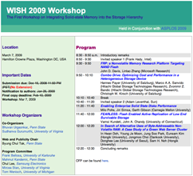

Before this year's ASPLOS conference, I'll be speaking at the [First Workshop on Integrating Solid-state Memory into the Storage Hierarchy (WISH2009)](http://csl.cse.psu.edu/wish2009.html). It looks like a great program with some terrific papers on how to use flash effectively and how to combine various solid state technologies to complement conventional storage.

I'll be talking about the work we've done at Sun on [the Hybrid Storage Pool](http://dtrace.org/blogs/ahl/hybrid_storage_pools_in_cacm). In addition I'll discuss some of the new opportunities that flash and other solid state technologies create. The workshop takes place in Washington D.C. on March 7th. Hope to see you there.

In semi-related news, along with [Eric](http://blogs.sun.com/eschrock) and [Mike](http://blogs.sun.com/mws) I'll be speaking at the [OpenSolaris Storage Summit](http://wikis.sun.com/display/OpenSolaris/OpenSolaris+Storage+Summit+200902) in San Francisco this coming Monday the 23rd.

**Update March 7, 2009:** I've subsequently posted the slides I used for the [WISH 2009](http://dtrace.org/blogs/ahl/hsp_wish_2009) and [OpenSolaris Storage Summit 2009](http://dtrace.org/blogs/ahl/hsp_talk_at_the_opensolaris) talks.
