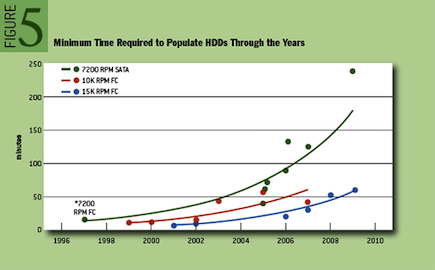

When I [first wrote about triple-parity RAID](http://dtrace.org/blogs/ahl/triple_parity_raid_z) in ZFS and the [Sun Storage 7000 series](http://www.sun.com/storage/disk_systems/unified_storage/resources.jsp), I alluded a looming requirement for triple-parity RAID due to a growing disparity between disk capacity and throughput. I've [written an article](http://queue.acm.org/detail.cfm?id=1670144) in [ACM Queue](http://queue.acm.org/) examining this phenomenon in detail, and making the case for triple-parity RAID. Dominic Kay helped me sift through hard drive data for the past ten years to build a model for how long it takes to fully populate a drive. I've reproduced a graph here from the paper than displays the timing data for a few common drive types — the trends are obviously quite clear.

The time to populate a drive is directly relevant for RAID rebuild. As disks in RAID systems take longer to reconstruct, the reliability of the total system decreases due to increased periods running in a degraded state. Today that can be four hours or longer; that could easily grow to days or weeks. RAID-6 grew out of a need for a system more reliable than what RAID-5 could offer. We are approaching a time when RAID-6 is no more reliable than RAID-5 once was. At that point, we will again need to refresh the reliability of RAID, and RAID-7, triple-parity RAID, will become the new standard.

> **Triple-Parity RAID and Beyond**  
> **ADAM LEVENTHAL, SUN MICROSYSTEMS**  
> As hard-drive capacities continue to outpace their throughput, the time has come for a new level of RAID. How much longer will current RAID techniques persevere? The RAID levels were codified in the late 1980s; double-parity RAID, known as RAID-6, is the current standard for high-availability, space-efficient storage. The incredible growth of hard-drive capacities, however, could impose serious limitations on the reliability even of RAID-6 systems. Recent trends in hard drives show that triple-parity RAID must soon become pervasive. In 2005, Scientific American reported on Kryder's law, which predicts that hard-drive density will double annually. While the rate of doubling has not quite maintained that pace, it has been close.  
>   
> Problematically for RAID, hard-disk throughput has failed to match that exponential rate of growth. Today repairing a high-density disk drive in a RAID group can easily take more than four hours, and the problem is getting significantly more pronounced as hard-drive capacities continue to outpace their throughput. As the time required for rebuilding a disk increases, so does the likelihood of data loss. The ability of hard-drive vendors to maintain reliability while pushing to higher capacities has already been called into question in this magazine. Perhaps even more ominously, in a few years, reconstruction will take so long as to effectively strip away a level of redundancy. What follows is an examination of RAID, the rate of capacity growth in the hard-drive industry, and the need for triple-parity RAID as a response to diminishing reliability.  
>   
> \[[...](http://queue.acm.org/detail.cfm?id=1670144)\]
