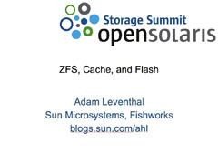

The organizers of the [OpenSolaris Storage Summit](http://wikis.sun.com/display/OpenSolaris/OpenSolaris+Storage+Summit+200902) asked me to give a presentation about [Hybrid Storage Pools](http://dtrace.org/blogs/ahl/hybrid_storage_pools_in_cacm) and [ZFS](http://opensolaris.org/os/community/zfs/). You can download the presentation titled [ZFS, Cache, and Flash](http://dtrace.org/resources/ahl/opensolaris_hsp.pdf). In it, I talk about flash as a new caching tier in the storage hierarchy, some of the innovations in ZFS to enable the HSP, and an aside into the how we implement an [HSP in the Sun Storage 7410](http://dtrace.org/blogs/ahl/fishworks_launch).
