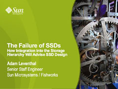

Today at [The First Workshop on Integrating Solid-state Memory into the Storage Hierarchy (WISH 2009)](http://csl.cse.psu.edu/wish2009.html) I gave a short talk about [our experience](http://dtrace.org/blogs/ahl/hybrid_storage_pools_in_cacm) integrating flash into the storage hierarchy and the interaction with SSDs. In the talk I discussed the recent history of flash SSDs as well as some key areas for future improvements. You can download it [here](http://dtrace.org/resources/ahl/leventhal_wish_2009.pdf). The workshop was terrific with some great conversations about the state of solid state storage and its future directions; thank you to the organizers and participants.
