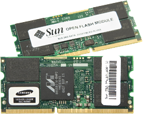

We're announcing a couple of new things in the flash SSD space. First, [support the Intel X25-E SSD](http://www.sun.com/storage/flash/index.jsp) in a bunch of our servers. This can be used to create a [Hybrid Storage Pool](http://dtrace.org/blogs/ahl/hybrid_storage_pools_in_cacm) like in the [Sun Storage 7000 series](http://dtrace.org/blogs/ahl/fishworks_launch), or as just a little flash for high performance / low power / tough environmentals.

Second, we're introducing a new open standard with the [Open Flash Module](http://www.sun.com/storage/flash/module.jsp). This creates a new form factor for SSDs bringing flash even closer to the CPU for higher performance and tighter system integration. SSDs in HDD form factors were a reasonable idea to gain market acceptance in much the same way as you first listened to your iPod over your car stereo with that weird tape adapter. Now the iPod is a first class citizen in many cars and, with the Open Flash Module, flash has found a native interface and form factor. This is a building block that we're very excited about, and it was designed specifically for use with ZFS and the Hybrid Storage Pool. Stay tuned: these flash miniDIMMs as they're called will be showing up in some interesting places soon enough. Speaking personally, this represents an exciting collaboration of hardware and software, and it's gratifying to see Sun showing real leadership around flash through innovation.
