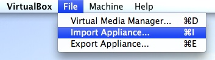
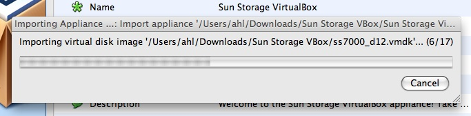
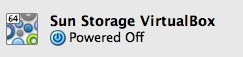
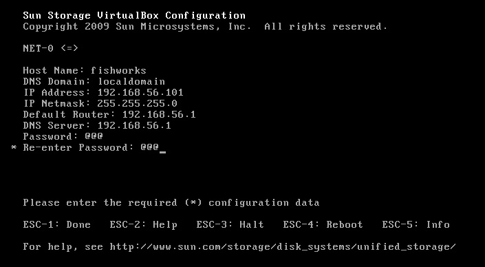

On the heels of the 2009.Q2.0.0 release, we've posted an update to the [Sun Storage 7000 simulator](http://dtrace.org/blogs/ahl/fishworks_vm). The simulator contains the exact same software as the other members of the 7000 series, but runs inside a VM rather than on actual hardware. It supports all the same features, and has all the same UI components; just remember that an actual 7000 series appliance is going to perform significantly better than a VM running a [puny laptop CPU](http://blogs.sun.com/bmc/entry/moore_s_outlaws). Download the simulator [here](http://www.sun.com/storage/disk_systems/unified_storage/resources.jsp).

The new version of the simulator contains two enhancements. First, it comes with the 2009.Q2.0.0 release pre-installed. The Q2 release is the first to provide full support for the simulator, and as I wrote [here](http://dtrace.org/blogs/ahl/sun_storage_7000_simulator_upgrade) you can simply upgrade your old simulator. In addition, while the original release of the simulator could only be run on VMware we now support both VMware and [VirtualBox](http://www.virtualbox.org/) (version 2.2.2 or later). When we first launched the 7000 series back in November, we intended to support the simulator on VirtualBox, but a couple of issues thwarted us, in particular lack of OVF support and host-only networking. The recent 2.2.2 release of VirtualBox brought those missing features, so we're pleased to be able to support both virtualization platforms.

 As OVF support is new in VirtualBox, here's a quick installation guide for the simulator. After uncompressing the SunStorageVBox.zip archive, select "Import Appliance...", and select "Sun Storage VirtualBox.ovf". Clicking through will bring up a progress bar. Be warned: this can take a while depending on the speed of your CPU and hard drive.

When that completes, you will see the "Sun Storage VirtualBox" VM in the VirtualBox UI. You may need to adjust settings such as the amount of allocated memory, or extended CPU features. Run the VM and follow the instructions when it boots up. You'll be prompted for some simple network information. If you're unsure how to fill in some of the fields, here are some pointers: 

- **Host Name** - whatever you want
- **DNS Domain** - "localdomain"
- **Default Router** - the same as the IP address but put 1 as the final octet
- **DNS Server** - the same as the IP address but put 1 as the final octet
- **Password** - whatever you want and something you can remember

When you complete that form, wait until you're given a URL to copy into a web browser. Note that you'll need to use the version of the URL with the IP address (unless you've added an entry to your DNS server). In the above example, that would be: https://192.168.56.101:215/. From the web browser, complete the appliance configuration, and then you can start serving up data, observing activity with Storage Analytics, and kicking the tires on a functional replica of a 7000 series appliance.
