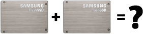
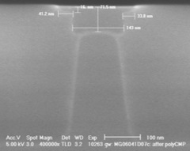

As flash memory has become more and more prevalent in storage from the [consumer](http://www.apple.com/ipodnano/) to theenterprise people have been charmed by the performance characteristics, but get stuck on the longevity. SSDs based on SLC flash are typically rated at 100,000 to 1,000,000 write/erase cycles while MLC-based SSDs are rated for significantly less. For conventional hard drives, the distinct yet similar increase in failures over time has long been solved by mirroring (or [other redundancy techniques](http://dtrace.org/blogs/ahl/double_parity_raid_z)). When applying this same solution to SSDs, a common concern is that two identical SSDs with identical firmware storing identical data would run out of write/erase cycles for a given cell at the same moment and thus data reliability would not be increased via mirroring. While the logic might seem reasonable, permit me to dispel that specious argument.

### The operating system and filesystem

From the level of most operating systems or filesystems, an SSD appears like a conventional hard drive and is treated more or less identically (Solaris' ZFS being a [notable exception](http://dtrace.org/blogs/ahl/hybrid_storage_pools_in_cacm)). As with hard drives, SSDs can report predicted failures though [SMART](http://en.wikipedia.org/wiki/Self-Monitoring,_Analysis,_and_Reporting_Technology). For reasons described below, SSDs already keep track of the wear of cells, but one could imagine even the most trivial SSD firmware keeping track of the rapidly approaching write/erase cycle limit and notifying the OS or FS via SMART which would in turn the user. Well in advance of actual data loss, the user would have an opportunity to replace either or both sides of the mirror as needed.

### SSD firmware

Proceeding down the stack to the level of the SSD firmware, there are two relevant features to understand: wear-leveling, and excess capacity. There is not a static mapping between the virtual offset of an I/O to an SSD and the physical flash cells that are chosen by the firmware to record the data. For a variety of reasons — flash call early mortality, write performance, bad cell remapping — it is necessary for the SSD firmware to remap data all over its physical flash cells. In fact, hard drives have a similar mechanism by which they hold sectors in reserve and remap them to fill in for defective sectors. SSDs have the added twist that they want to maximize the longevity of their cells each of which will ultimately decay over time. To do this, the firmware ensures that a given cell isn't written far more frequently than any other cell, a process called wear-leveling for obvious reasons.

To summarize, subsequent writes to the same LBA, the same virtual location, on an SSD could land on different physical cells for the several reasons listed. The firmware is, more often than not, deterministic thus two identical SSDs with the exact same physical media and I/O stream (as in a mirror) would behave identically, but minor timing variations in the commands from operating software, and differences in the media (described below) ensure that the identical SSDs will behave differently. As time passes, those differences are magnified such that two SSDs that started with the same mapping between virtual offsets and physical media will quickly and completely diverge.

### Flash hardware and physics

Identical SSDs with identical firmware, still have their own physical flash memory which can vary in quality. To break the problem apart a bit, an SSD is composed of many cells, and each cell's ability to retain data slowly degrades as it's exercised. Each cell is in fact a physical component of an integrated circuit composed. Flash memory differs from many other integrated circuits in that it requires far higher voltages than others. It is this high voltage that causes the oxide layer to gradually degrade over time. Further, all cells are not created equal — microscopic variations in the thickness and consistency of the physical medium can make some cells more resilient and others less; some cells might be DOA, while others might last significantly longer than the norm. By analogy, if you install new light bulbs in a fixture, they might burn out in the same month, but how often do they fail on the same day? The variability of flash cells impacts the firmware's management of the underlying cells, but more trivially it means that two SSDs in a mirror would experience dataloss of corrsponding regions at different rates.

### Wrapping up

As with conventional hard drives, mirroring SSDs is a good idea to preserve data integrity. The operating system, filesystem, SSD firmware, and physical properties of the flash medium make this approach sound both in theory and in practice. Flash is a new exciting technology and changes many of the assumptions derived from decades of experience with hard drives. As always proceed with care — especially when your data is at stake — but get the facts, and in this case the wisdom of conventional hard drives still applies.
