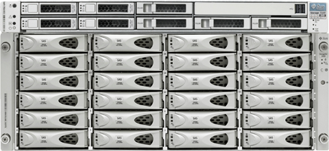
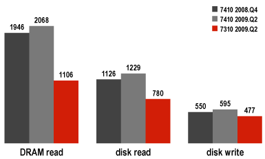
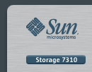

Today we're introducing a new member to the Sun Unified Storage family: the Sun Storage 7310. The 7310 is a scalable system from 12TB with a single half-populated J4400 JBOD up to 96TB with 4 JBODs. You can combine two 7310 head units to form a cluster. The base configuration includes a single quad-core CPU, 16GB of DRAM, a SAS HBA, and two available PCIe slots for NICs, backup cards, or the Fishworks [cluster card](http://blogs.sun.com/wesolows/entry/low_availability_clusters). The 7310 can be thought of as a smaller capacity, lower cost version of the Sun Storage 7410. Like the 7410 it uses high density, low power disks as primary storage and can be enhanced with Readzilla and Logzilla flash accelerators for high performance. Like all the 7000 series products, the 7310 includes all protocols and software features without license fees.

The 7310 is an entry-level clusterable, scalable storage server, but the performance is hardly entry-level. [Brendan Gregg](http://blogs.sun.com/brendan) from the Fishworks team has detailed the [performance of the 7410](http://blogs.sun.com/brendan/entry/my_sun_storage_7410_perf), and has published the [results of those tests](http://blogs.sun.com/brendan/entry/my_sun_storage_7310_perf) on the new 7310. Our key metrics are cached reads from DRAM, uncached reads from disk, and writes to disk all over two 10GbE links with 20 client systems. As shown in the graph, the 7310 is an absolute champ, punching well above its weight. The numbers listed are in units of MB/s. Notice that the recent [2009.Q2](http://blogs.sun.com/fishworks/entry/sun_storage_7000_2009_q2) software update brought significant performance improvements to the 7410, and that the 7310 holds its own. For owners of entry-level systems from other vendors, check for yourself, but the 7310 is a fire-breather.

Added to the low-end 7110, the dense, expandable 7210, the high-end clusterable, expandable 7410, the 7310 fills an important role in the 7000 series product line: an entry-level clusterable, expandable system, with impressive performance, and an attractive price. If the specs and performance have piqued your interest, try out the user interface on the 7000 series with the [Sun Storage 7000 simulator](http://dtrace.org/blogs/ahl/ss_7000_simulator_update_plus).
