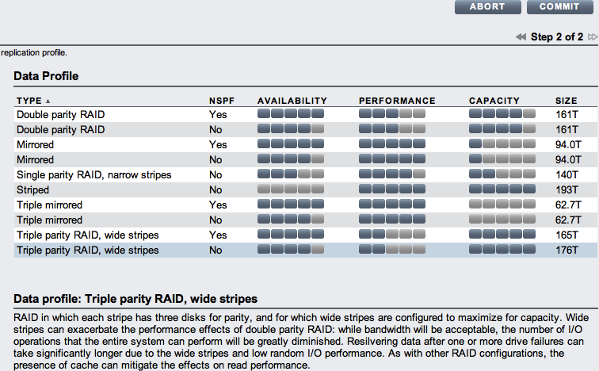

Today we shipped our [2009.Q3 release](http://blogs.sun.com/fishworks/entry/sun_storage_7000_2009_q3). Amidst the many great new features, enhancements and bug fixes, we've added new storage profiles for [triple-parity RAID](http://dtrace.org/blogs/ahl/triple_parity_raid_z) and three-way mirroring. Here's an example on a 9 JBOD system of what you'll see in the updated storage configuration screen:

Note that the new Triple parity RAID, wide stripes option replaces the old Double parity RAID, wide stripes configuration. With RAID stripes that can easily be more than 40 disks wide, and resilver times that can be quite long as a result, we decided that the additional protection of triple-parity RAID trumped the very small space efficiency of double-parity RAID.

[Ryan Matthews](http://blogs.sun.com/rdm/) has updated the [space calculator for the 7310 and 7410](http://dtrace.org/blogs/ahl/sun_storage_7410_space_calculator#u20090916) to include the new profiles. [Download](https://cds.sun.com/is-bin/INTERSHOP.enfinity/WFS/CDS-CDS_SMI-Site/en_US/-/USD/ViewProductDetail-Start?ProductRef=SS7000SU-2009.Q3.0.0-OTH-G-F@CDS-CDS_SMI) the new update and give it a shot.
