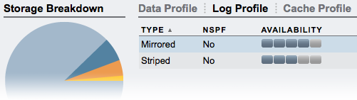

The [Hybrid Storage Pool](http://dtrace.org/blogs/ahl/hybrid_storage_pools_in_cacm) integrates flash into the storage hierarchy in two specific ways: as a massive read cache and as fast log devices. For read cache devices, Readzillas, there's no need for redundant configurations; it's a clean cache so the data necessarily also resides on disk. For log devices, Logzillas, redundancy is essential, but how that translates to their configuration can be complicated. How to decide whether to stripe or mirror?

### ZFS intent log devices

Logzillas are used as ZFS intent log devices ([slogs](http://blogs.sun.com/perrin/entry/slog_blog_or_blogging_on) in ZFS jargon). For certain synchronous write operations, data is written to the Logzilla so the operation can be acknowledged to the client quickly before the data is later streamed out to disk. Rather than the milliseconds of latency for disks, Logzillas respond in about 100μs. If there's a power failure or system crash before the data can be written to disk, the log will be replayed when the system comes back up, the only scenario in which Logzillas are read. Under normal operation they are effectively write-only. Unlike Readzillas, Logzillas are integral to data integrity and they are relied upon for data integrity in the case of a system failure.

A common misconception is that a non-redundant Logzilla configuration introduces a single point of failure into the system, however this is not the case since the data contained on the log devices is also held in system memory. Though that memory is indeed volatile, data loss could only occur if both the Logzilla failed _and_ the system failed within a fairly small time window.

### Logzilla configuration

While a Logzilla doesn't represent a single point of failure, redundant configurations are still desirable in many situations. The Sun Storage 7000 series implements the Hybrid Storage Pool, and offers several different redundant disk configurations. Some of those configurations add a single level of redundancy: mirroring and single-parity RAID. Others provide additional redundancy: triple-mirroring, double-parity RAID and triple-parity RAID. For disk configurations that provide double disk redundancy of better, the best practice is to mirror Logzillas to achieve a similar level of reliability. For singly redundant disk configurations, non-redundant Logzillas might suffice, but there are conditions such as a critically damaged JBOD that could affect both Logzilla and controller more or less simultaneously. Mirrored Logzillas add additional protection against such scenarios.

Note that the Logzilla configuration screen (pictured) includes a column for No Single Point of Failure (NSPF). Logzillas are never _truly_ a single point of failure as previous discussed; instead, this column refers to the arrangement of Logzillas in JBODs. A value of true indicates that the configuration is resilient against JBOD failure.

The most important factors to consider when deciding between mirrored or striped Logzillas are the consequences of potential data loss. In a failure of Logzillas and controller, data will not be corrupted, but the last 5-30 seconds worth of transactions _could_ be lost. For example, while it typically makes sense to mirror Logzillas for triple-parity RAID configurations, it may be that the data stored is less important and the implications for data loss not worthy of the cost of another Logzilla device. Conversely, while a mirrored or single-parity RAID disk configuration provides only a single level of redundancy, the implications of data loss might be such that the redundancy of volatile system memory is insufficient. Just as it's important to choose the appropriate disk configuration for the right balance of performance, capacity, and reliability, it's at least as important to take care and gather data to make an informed decision about Logzilla configurations.
