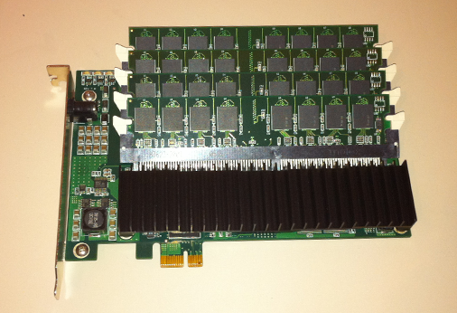
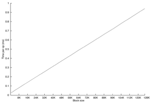

A key component of the ZFS [Hybrid Storage Pool](http://dtrace.org/blogs/ahl/hybrid_storage_pools_in_cacm) is Logzilla, a very fast device to accelerate synchronous writes. This component hides the write latency of disks to enable the use of economical, high-capacity drives. [In the Sun Storage 7000 series](http://dtrace.org/blogs/ahl/fishworks_launch), we use some very fast SAS and SATA SSDs from [STEC](http://www.stec-inc.com/) as our Logzilla &mdash the devices are great and STEC continues to be a terrific partner. The most important attribute of a good Logzilla device is that it have very low latency for sequential, uncached writes. The STEC part gives us about 100μs latency for a 4KB write — much much lower than most SSDs. Using SAS-attached SSDs rather than the more traditional PCI-attached, non-volatile DRAM enables a much simpler and more reliable clustering solution since the intent-log devices are accessible to both nodes in the cluster, but SAS is much slower than PCIe...

### DDRdrive X1

Christopher George, CTO of [DDRdrive](http://www.ddrdrive.com/) was kind enough to provide me with a sample of the X1, a 4GB NV-DRAM card with flash as a backing store. The card contains 4 DIMM slots populated with 1GB DIMMs; it's a full-height card which limits its use in Sun/Oracle systems (typically half-height only), but there are many systems that can accommodate the card. The X1 employs a novel backup power solution; our Logzilla used in the 7000 series protects its DRAM write cache with a large super-capacitor, and many NV-DRAM cards use a battery. Supercaps can be limiting because of their physical size, and batteries have a host of problems including leaking and exploding. Instead, the DDRdrive solution puts a DC power connector on the PCIe faceplate and relies on an external source of backup power (a UPS for example).

### Performance

I put the DDRdrive X1 in our fastest prototype system to see how it performed. A 4K write takes about 51μs — better than our SAS Logzilla — but the SSD outperformed the X1 at transfer sizes over 32KB. The performance results on the X1 are already quite impressive, and since I ran those tests the firmware and driver have undergone several revisions to improve performance even more.

### As a Logzilla

While the 7000 series won't be employing the X1, uses of ZFS that don't involve clustering and for which external backup power is an option, the X1 is a great and economical Logzilla accelerator. Many users of ZFS have already started hunting for accelerators, and have tested out a wide array of SSDs. The X1 is a far more targeted solution, and is a compelling option. And if write performance has been a limiting factor in deploying ZFS, the X1 is a good reason to give ZFS another look.
