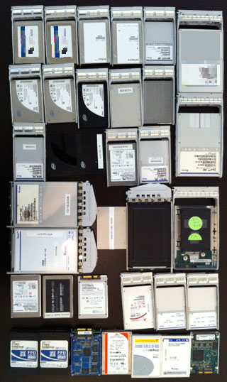

 This year's flash memory summit got me thinking about our use of SSDs over the years at Fishworks. The picture of our left is a visual history of SSD evals in rough chronological order from the oldest at the bottom to the newest at the top (including some that have yet to see the light of day).

### Early Days

When we started Fishworks, we were inspired by the possibilities presented by [ZFS](http://hub.opensolaris.org/bin/view/Community+Group+zfs/WebHome) and [Thumper](http://www.sun.com/images/k3/k3_sunfirex4500_4.jpg). Those components would be key building blocks in the enterprise storage solution that became the 7000 series. An immediate deficiency we needed to address was how to deliver competitive performance using 7,200 RPM disks. Folks like NetApp and EMC use PCI-attached NV-DRAM as a write accelerator. We evaluated something similar, but found the solution lacking because it had limited scalability (the biggest NV-DRAM cards at the time were 4GB), consumed our limited PCIe slots, and required a high-speed connection between nodes in a cluster (e.g. IB, further eating into our PCIe slot budget).

The idea we had was to use flash. None of us had any experience with flash beyond cell phones and USB sticks, but we had the vague notion that flash was fast and getting cheaper. By luck, flash SSDs were just about to be where we needed them. In late 2006 I started evaluating SSDs on behalf of the group, looking for what we would eventually call [Logzilla](http://dtrace.org/blogs/ahl/fishworks_launch). At that time, SSDs were getting affordable, but were designed primarily for environments such as military use where ruggedness was critical. The performance of those early SSDs was typically awful.

### Logzilla

STEC — still Simpletech in those days — realized that their early samples didn't really suit our needs, but they had a new device (partly due to the acquisition of Gnutech) that would be a good match. That first sample was fibre-channel and took some finagling to get working (memorably it required metric screw of an odd depth), but the Zeus IOPS, an 18GB 3.5" SATA SSD using SLC NAND, eventually became our Logzilla (we've recently updated it with a SAS version for our updated SAS-2 JBODs). Logzilla addressed write performance economically, and scalably in a way that also simplified clustering; the next challenge was read performance.

### Readzilla

Intent on using commodity 7,200 RPM drives, we realized that our random read latency would be about twice that of 15K RPM drives (duh). Fortunately, most users don't access all of their data randomly (regardless of how [certain benchmarks](http://dtrace.org/blogs/bmc/2009/02/02/eulogy-for-a-benchmark/) are designed). We already had much more DRAM cache than other storage products in our market segment, but we thought that we could extend that cache further by using SSDs. In fact, the invention of the [L2ARC](http://blogs.sun.com/brendan/entry/test) followed a slightly different thought process: seeing the empty drive bays in the front of our system (just two were used as our boot disks) and the piles of SSDs laying around, I stuck the SSDs in the empty bays and figured out how we'd use them.

It was again STEC who stepped up to provide our Readzilla, a 100GB 2.5" SATA SSD using SLC flash.

### Next Generation

Logzilla and Readzilla are important features of the [Hybrid Storage Pool](http://dtrace.org/blogs/ahl/hybrid_storage_pools_in_cacm). For the next generation expect the 7000 series to move away from SLC NAND flash. It was great for the first generation, but other technologies provide better $/IOPS for Logzilla and better $/GB for Readzilla (while maintaining low latency). For Logzilla we think that NV-DRAM is a better solution (I reviewed one such solution [here](http://dtrace.org/blogs/ahl/ddrdrive)), and for Readzilla MLC flash has sufficient performance at much lower cost and ZFS will be able to ensure the longevity.
