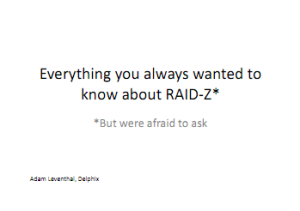

I had the chance to speak at the OpenStorage Summit a couple of weeks ago about RAID-Z (the ZFS implementation of RAID). The talk was an accumulation of blog posts and articles written by me and others as well as quite a bit of new material that's been building up. The talk was an overview of the history of RAID-Z, the strengths and weaknesses that have emerged, and a look towards the challenges ahead for ZFS and RAID with some possible solutions and mitigating factors. Thanks to Nexenta for putting the conference together; questions or comments are very welcome.
