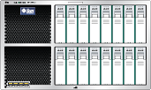

On the heels of the [2010.Q1 software release](http://blogs.sun.com/fishworks/entry/sun_storage_7000_2010_q1), we've provided a new version of the Sun Storage 7000 simulator that can be found at this [new location](http://www.oracle.com/webapps/dialogue/dlgpage.jsp?p_ext=Y&p_dlg_id=8588618&src=6870265&Act=7). As noted [previously](http://dtrace.org/blogs/ahl/fishworks_vm), the simulator is a terrific way to take the Sun Storage 7000 user interface for a spin; it includes the exact same software as a physical 7000 series system with the same features.

The last release of the simulator [added support](http://dtrace.org/blogs/ahl/ss_7000_simulator_update_plus) for [VirtualBox](http://www.virtualbox.org/); this release now removes support for VMware. VMware was tremendously useful for our initial release, but VirtualBox has addressed the problems that initially excluded it, and the maintenance burden of supporting two virtual platforms has led us to drop VMware in this release. Future releases of the simulator will continue to be VirtualBox-only; our hope is that this doesn't create a significant impediment as VirtualBox is free and readily available.
