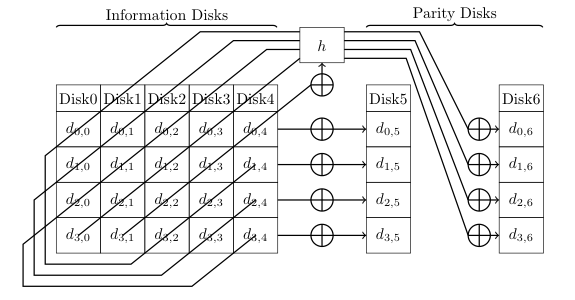
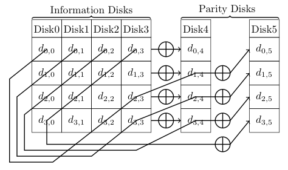
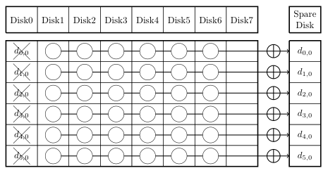
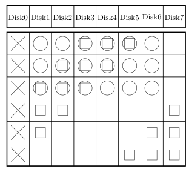

\[latexpage\] RAID algorithms have become a particular fascination of mine, and I recently read a [very interesting paper that describes an optimization for RAID reconstruction](http://www.cse.cuhk.edu.hk/~cslui/PUBLICATION/TOS.pdf) (by Xiang, Xu, Lui, Chang, Pan, and Li). Before writing [double-](http://dtrace.org/blogs/ahl/2006/06/18/double-parity-raid-z/) and [triple-parity](http://dtrace.org/blogs/ahl/2009/07/21/triple-parity-raid-z/) RAID algorithms for ZFS, I spent a fair bit of time researching the subject and have stayed interested since. Before describing the reconstruction optimization, some preamble is required. RAID algorithms can be divided into two buckets: one-dimensional algorithms, and multi-dimensional algorithms (terms of my own choosing; I haven't seen this distinction discussed in literature).

### One-dimensional RAID

A one-dimensional algorithm is one in which all data in a single RAID stripe is used to compute all parities. The RAID algorithm used by ZFS falls into this category as do most algorithms derived from Reed-Solomon coding. For a given RAID stripe's set of data blocks, $D$, we can compute the nth parity block with some function $p(D, n)$. For example, ZFS, roughly, uses the formula \\\[ p(D,n) = \\sum\_{i=1}^{\\left|{D}\\right|} 2^{(i-1)(n-1)} \\cdot D\_{i} \\\] Here, addition and multiplication are defined over a Galois Field – the explanation would be far longer than it would be interesting or relevant so I’ll omit it from this post. It is worth noting that this particular approach only works for three parity disks or fewer, but that too is an entirely different subject (albeit an interesting one). Reconstruction of a missing block in a one-dimensional algorithm requires reading the available data, and performing some computation; each stripe may be reconstructed separately (and thus, in parallel).

### Multi-dimensional RAID

A multi-dimensional algorithm is one in which parts of multiple logical RAID stripes may contribute to parity calculation. Examples of this include IBM’s [EVENODD](http://dl.acm.org/citation.cfm?id=192007.192033) and NetApp’s slight simplification, [Row-Diagonal Parity](http://usenix.org/events/fast04/tech/corbett/corbett.pdf) (RDP). These are most easily conveyed through diagrams:

\[caption id="attachment\_855" align="aligncenter" width="345" caption="EVENODD"\]\[/caption\]

\[caption id="attachment\_856" align="aligncenter" width="284" caption="RDP"\]\[/caption\]

With both EVENODD and RDP, calculation of the first parity block simply XOR the data blocks in that RAID stripe. The second parity block is calculated by a simple XOR of data values across RAID stripes more or less diagonally. Both of these techniques place constraints on the width of a RAID stripe.

### Optimizing RAID reconstruction for fewer reads

The paper, [A Hybrid Approach of Failed Disk Recovery Using RAID-6 Codes: Algorithms and Performance Evaluation](http://www.cse.cuhk.edu.hk/~cslui/PUBLICATION/TOS.pdf), describes a optimization for reconstruction under multi-dimensional RAID algorithms. The key insight is that with parity calculations that effectively overlap, a clever reconstruction algorithm can use fewer blocks, thus incurring fewer disk reads. As described in the paper, normally when a given disk fails, all remaining data blocks and blocks from the first parity disk are used for reconstruction:

\[caption id="attachment\_857" align="aligncenter" width="279" caption="simple recovery"\]\[/caption\]

It is, however, possible to read fewer total blocks by taking advantage of the fact that certain blocks can be multiply used. In the reconstruction below, blocks with circles are used for “row” reconstruction, and blocks with squares are used for “diagonal” reconstruction.

\[caption id="attachment\_858" align="aligncenter" width="187" caption="optimized recovery"\]\[/caption\]

Note that the simple approach requires reading 36 blocks (none from disk 7) whereas the reconstruction described in the paper requires reading only 27 blocks. This applies generally: the new approach requires 25% fewer blocks to perform the same reconstruction. And the paper includes a method of balancing the reads between disks.

### Disappointing results

Unfortunately, optimizing for fewer reads didn’t translate to significant performance improvements in the overall recovery. For RDP it was about 12% better in the best case, but typically closer to 7%. For EVENODD the improvement was less than 5% in all cases. Why? The naïve recovery algorithm streams data off the healthy hard drives, performs a simple computation, and streams good data onto the replacement drive. Streaming is what drives do best – 3.5” or 2.5”, 7200, 10K, or 15K RPM; SATA, SAS, or FC they all stream pretty well. There may be some contention for I/O resources, but either that contention isn’t severe or the “skips” in the I/O patterns interrupt the normal streaming efficiency.

### Applicability in flash

There’s another medium, however, that has throughput and IOPS to spare where this RAID reconstruction approach could be highly effective: flash. With SSDs, it’s possible to see throughput that strains the limits of I/O systems; reading less data could be a significant improvement, and the non-contiguous read patterns wouldn’t degrade performance as they do with HDDs. For all-flash arrays, this sort of optimization may be one of many in its class; with a surplus of IOPS, compute, and memory, the RAID algorithms designed for slow disks, slow CPUs, and a dearth of DRAM, may need to be scrapped and rethought.
