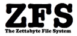

Exactly 10 years ago today, Jeff Bonwick and Matt Ahrens got their first ZFS prototype working in user-land. Jeff had scrapped his previous attempt at reinventing filesystems, working through the established filesystem management and engineering channels at Sun, and this time started with a clean sheet of paper. Matt had joined Sun that June shortly after graduating from Brown University. Both prodigious coders, the duo, in remarkably short order, showed us a glint of what ZFS would be. A year later, the master and apprentice had ZFS working in the kernel, moving data from end to end. Three years after that, standing in front of a team of a dozen engineers, Matt typed 'putback' to integrate ZFS into Solaris. The distance ZFS has traveled these past 10 years has been monumental, and ZFS has indelibly impacted the industry. ZFS is one of the load-bearing pillars here at Delphix; without it, our task would have been too ambitious to even begin. Congratulations to our own Matt Ahrens on this milestone, as well as to Jeff, and everyone else who has contributed to ZFS over the last 10 years including the growing community building new products around ZFS and illumos.

**Update:** Check out [Matt's blog post](http://blog.delphix.com/matt/2011/11/01/zfs-10-year-anniversary/) on the subject.
