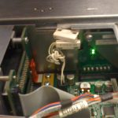

Back at [Fishworks](http://dtrace.org/blogs/bmc/2008/11/10/fishworks-now-it-can-be-told/), my colleagues had a nickname for me: **Adam Leventhal, Hardware Engineer**. I wasn't designing hardware; I wasn't even particularly more involved with hardware specs. The name referred to my preternatural ability to fit round pegs into square holes, to know when parts would bend but not break (or if they broke how to clean up the evidence), and when a tight fit necessitated a running start.

I first earned the nickname when we got the prototype hardware for what would eventually becomes the Sun Storage 7410 -- part of our initial product line, and our first product to support clustering. When the system arrived, and I tried to install a SAS HBA, I encountered my first hardware bug. In the Solaris kernel group I had hit microprocessor bugs, but this was pretty different: the actual sheet metal was designed for cards to drop in horizontally, and the designers hadn't considered connectors that protruded from a PCI card's faceplate.

To solve the problem, I had to (carefully) bend back the retaining metal supports, drop in the card, and then try to bend them back. I think my colleagues were just impressed that I didn't break anything.

The hardware team took our feedback and designed a different mechanism for inserting PCI cards.

### Science Experiments with SSDs

Another task that fell to Adam Leventhal, Hardware Engineer was conducting the science experiments we needed to verify if something was a stupid idea or merely a crazy one. Often this took the form of trying to make something fit somewhere it wasn't supposed to fit. For example, we often had 2.5" SSDs that we wanted to stick into 3.5" drive bays to eliminate as many variables as possible when baking off a 2.5" SSD versus as 3.5" one. Here are some examples:

\[caption id="attachment\_1003" align="alignleft" width="300" caption="some SSDs in a Thumper (SS7200)"\]\[/caption\]

\[caption id="attachment\_1004" align="alignright" width="200" caption="an SSD in a Riverwalk (J4400)"\]\[/caption\]

### The Ice-Cream Sandwich

Another favorite experiment involving SSDs came when we were first investigating [Readzilla](http://dtrace.org/blogs/ahl/2008/11/10/hybrid-storage-pools-in-the-7410/) candidates. We wanted to get as much capacity as we could in the 2.5" drive bay. The prototypes of the Intel X25-E were only 7mm high so we speculated that we could make an "ice-cream sandwich" with some sort of chip to present them as a single SATA device. Well, we found such a chip, and so I ran the experiment to see what the hardware would look like to our OS and what the performance characteristics would be.

You can see the two Intel SSDs duct-taped together, and connected to a power supply in the background and the test board on the right. The test board has another SATA cable that snakes into the box and connects where the drive connector is at the back of the drive bay. Yes, it was a huge pain to connect that final cable; not pictured is the duct tape in the drive bay to keep the SATA cable in place.

The thing worked, but the performance was lousy, and we determined that two drives and some sort of interposer might fit, but it would be like sticking a potato up the tailpipe -- all airflow would be blocked.

### Conjoined Twins

By far my favorite science project was the conjoined twin Iwashis (SS7110). Iwashi was a stand-alone storage box with an internal SAS HBA that connected to a 16-disk backplane. It turned out though that only one of the two SAS connections was needed to see all the disks. Sitting around at lunch one day we had an idea: could we provide high availability for user data by getting a pair of Iwashis and cross-wiring their HBAs to connect to each others' backplanes. We would then mirror the data (or something) between the two boxes.

Note that that two systems needed to be placed head-to-toe in order to let the cables reach; take note of a few features in the picture above:

1. The SAS HBA in the right system...
2. connects up to the right system's own backplane...
3. and to the backplane on the left (note that running between the fan trays was the only option)...
4. which also connects up to the SAS HBA in the left system.

This all required running with the lid off. Those systems contained a magnetic kill switch -- if you removed the lid, the power would shut off. This was -- wisely -- to ensure proper airflow and to avoid overheating. But this interfered with this (and many other) experiments, so I just unscrewed the magnet from the lid and let it connect directly with its main chassis mate.

I could get the lid onto the left system, but I didn't want the fan tray lid pinching the SAS cable that ran between the two boxes. To this day, I think that propping up the fan tray lid is the best use of those discarded PCI faceplate fillers.

We scrapped this idea for a variety of concerns both mundane (we needed both SAS connectors to drive the LEDs for each drive), and fundamental (it was pretty clearly goofy).

### Still Hardware Engineering

At Delphix, we're selling a virtual appliance so the opportunities for Adam Leventhal, Hardware Engineer to shine are fewer and farther between. But hardware engineering has always been more of a state of mind... and there's still the occasional opportunity to stab at a jumper with a bread knife from the kitchen to generate an NMI and initiate a kernel panic!
