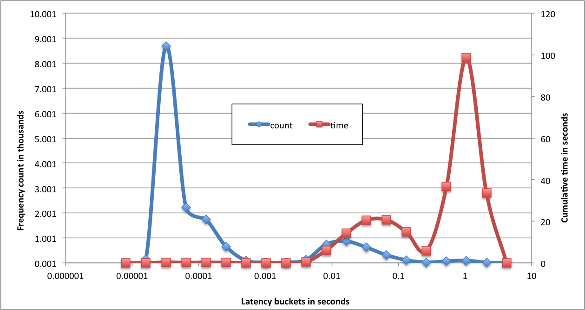

It's no small feat to build a stable, modern filesystem. The more I work with ZFS, the more impressed I am with how much it got right, and how malleable it’s proved. It has evolved to fix shortcomings and accommodate underlying technological shifts. It’s not surprising though that even while its underpinnings have withstood the test of production use, ZFS occasionally still shows the immaturity of the tween that it is.

Even before the ZFS storage appliance launched in 2008, ZFS was heavily used and discussed Solaris and OpenSolaris communities, the frequent subject of praise and criticism. A common grievance was that write-heavy workloads would consume massive amounts of system memory... and then render the system unusable as ZFS dutifully deposited the new data onto the often anemic storage (often a single spindle for OpenSolaris users).

For workloads whose ability to generate new data far outstripped the throughput of persistent storage, it became clear that ZFS needed to impose some limits. ZFS should have effective limits on the amount of system memory devoted to “dirty” (modified) data. Transaction groups should be bounded to prevent high latency IO and administrative operations. At a high level, ZFS transaction groups are just collections of writes (transactions), and there can be three transaction groups active at any given time; for a more thorough treatment, check out [last year's installment of ZFS knowledge](http://dtrace.org/blogs/ahl/2012/12/13/zfs-fundamentals-transaction-groups/).

## Write Throttle 1.0 (2008)

The proposed solution appealed to an intuitive understanding of the system. At the highest level, don’t let transaction groups grow indefinitely. When a transaction reached a prescribed size, ZFS would create a new transaction group; if three already existed, it would block waiting for the syncing transaction group to complete. Limiting the size of each transaction group yielded a number of benefits. ZFS would no longer consume vast amounts of system memory (quelling outcry from the user community). Administrative actions that execute at transaction group boundaries would be more responsive. And synchronous, latency-sensitive operations wouldn’t have to contend with a deluge of writes from the syncing transaction group.

So how big should transaction groups be? The solution included a target duration for writing out a transaction group (5 seconds). The size of each transaction group would be based on that time target and an inferred write bandwidth. Duration times bandwidth equals target size. The inferred bandwidth would be recomputed after each transaction group.

When the size limit for a transaction group was reached, new writes would wait for the next transaction group to open. This could be nearly instantaneous if there weren’t already three transaction groups active, or it could incur a significant delay. To ameliorate this, the write throttle would insert a 10ms delay for all new writes once 7/8th of the size had been consumed.

See the gory details in the [git commit](https://github.com/illumos/illumos-gate/commit/1ab7f2ded02e7a1bc3c73516eb27efa79bf2a2ff).

## Commentary

That initial write throttle made a comprehensible, earnest effort to address some critical problems in ZFS. And, to a degree, it succeeded. Though the lack of rigorous ZFS performance testing at that time is reflected in the glaring deficiencies with that initial write throttle. A [simple logic bug](https://github.com/illumos/illumos-gate/commit/e8397a2be4690aefe43370aae2d4214c6778327e) lingered for other two months, causing all writes to be delayed by 10ms, not just those executed after the transaction group had reached 7/8ths of its target capacity — trivial, yes, but debilitating and telling. The computation of the write throttle resulted in values that varied rapidly; eventually a [slapdash effort at hysteresis](https://github.com/illumos/illumos-gate/commit/05715f945c5c007fc4bb6a4e7cf4a749c9b30038) was added.

Stepping back, the magic constants arouse concern. Why should transaction groups last 5 seconds? Yes, they should be large enough to amortize metadata updates within a transaction group, and they should not be so large that they cause administrative unresponsiveness. For the [ZFS storage appliance](https://blogs.oracle.com/bmc/entry/fishworks_now_it_can_be) we experimented with lower values in an effort to smooth out the periodic bursts of writes — an effect we refer to as “[picket-fencing](http://dtrace.org/blogs/brendan/2009/06/26/slog-screenshots/)” for its appearance in our IO visualization interface. Even more glaring, where did the 7/8ths cutoff come from or the 10ms worth of delay? Even if the computed throughput was dead accurate, the algorithm would lead to ZFS unnecessarily delaying writes. At first blush, this scheme was not fatally flawed, but surely arbitrary, disconnected from real results, and nearly impossible to reason about on a complex system.

## Problems

The write throttle demonstrated problems more severe than the widely observed picket-fencing. While ZFS attempted to build a stable estimate of write throughput capacity, the computed number would, in practice, swing wildly. As a result, ZFS would variously over-throttle and under-throttle. It would often insert the 10ms delay, but that delay was intended merely as a softer landing than the hard limit. Once reached, the hard limit — still the primary throttling mechanism — could impose delays well in excess of a second.

The graph below shows the frequency (count) and total contribution (time) for power-of-two IO latencies from a production system.

The latency frequencies clearly show a tri-modal distribution: writes that happen at the speed of software (much less than 1ms), writes that are delayed by the write throttle (tens of milliseconds), and writes that bump up against the transaction group size (hundred of milliseconds up to multiple seconds).

The total accumulated time for each latency bucket highlights the dramatic impact of outliers. The 110 operations taking a second or longer contribute more to the overall elapsed time than the time of the remaining 16,000+ operations.

## A new focus

The first attempt at the write throttle addressed a critical need, but was guided by the need to patch a hole rather than an understanding of the fundamental problem. The rate at which ZFS can move data to persistent storage will vary for a variety of reasons: synchronous operations will consume bandwidth; not all writes impact storage in the same way — scattered writes to areas of high fragmentation may be slower than sequential writes. Regardless of the real, instantaneous throughput capacity, ZFS needs to pass on the effective cost — as measured in write latency — to the client. Write throttle 1.0 carved this cost into three tranches: writes early in a transaction group that pay nothing, those late in a transaction group that pay 10ms each, and those at the end that pick up the remainder of the bill.

If the rate of incoming data was less than the throughput capacity of persistent storage the client should be charged nothing — no delay should be inserted. The write throttle failed by that standard as well, delaying 10ms in situations that warranted no surcharge.

Ideally ZFS should throttle writes in a way that optimizes for minimized and consistent latency. As we developed a new write throttle, our objectives were low variance for write latency, and steady and consistent (rather than bursty) writes to persistent storage. In my next post I’ll describe the solution that Matt Ahrens and I designed for OpenZFS.
