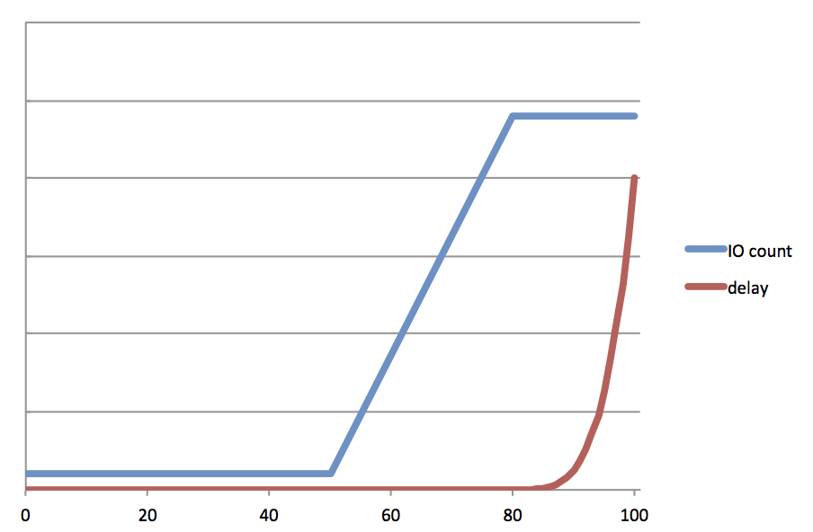
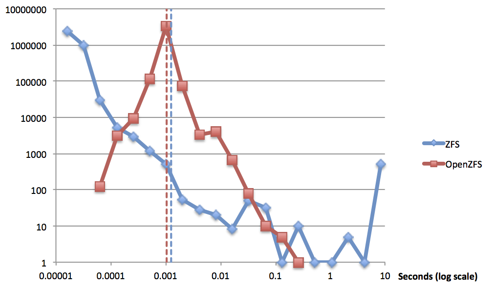

In my last blog post, I wrote about the [ZFS write throttle](http://dtrace.org/blogs/ahl/2013/12/27/zfs-fundamentals-the-write-throttle/), and how we saw it lead to pathological latency variability on customer systems. Matt Ahrens, the co-founder of ZFS, and I set about to fix it in [OpenZFS](http://www.open-zfs.org). While the solution we came to may seem obvious, we arrived at it only through a bit of wandering in a wide open solution space.

The ZFS write throttle was fundamentally flawed — the data indelibly supported this diagnosis. The cure was far less clear. The core problem involved the actual throttling mechanism, allowing many fast writes while stalling some writes nearly without bound, with some artificially delayed writes ostensibly to soften the landing. Further, the mechanism relied on an accurate calculation of the backend throughput — a problem in itself, but one we’ll set aside for the moment.

## On a frictionless surface in a vacuum…

Even in the most rigorously contrived, predictable cases, the old write throttle would yield high variance in the latency of writes. Consider a backend that can handle an unwavering 100MB/s (or 1GB/s or 10GB/s — pick your number). For a client with 10 threads executing 8KB async writes (again to keep it simple) to hit 100MB/s, the average latency would be around 780µs — not unreasonable.

Here’s how that scenario would play out with the old write throttle assuming full quiesced and syncing transaction groups (you may want to refer to [my last blog post](http://dtrace.org/blogs/ahl/2013/12/27/zfs-fundamentals-the-write-throttle/) for a refresher on the mechanism and some of the numbers). With a target of 5 seconds to write out its contents, the currently open transaction group would be limited to 500MB. Recall that after 7/8ths of the limit is consumed, the old write throttle starts inserting a 10ms delay, so the first 437.5MB would come sailing in, say, with an average latency of 780µs, but then the remaining writes would average at least 10ms (scheduling delay could drive this even higher). With this artificially steady rate, the delay would occur 7/8ths of the way into our 5 second window, with 1/8th of the total remaining. So with 5/8ths of a second left, and an average latency of 10ms, the client would be able to write only and additional 500KB worth of data. More simply: data would flow at 100MB/s most of the time, and at less than 1MB/s the rest.

In this example the system inserted far too much delay — indeed, no delay was needed. In another scenario it could just have easily inserted too little.

Consider a case where we would require writers to be throttled. This time, let’s say the client has 1000 threads, and — since it’s now relevant — let’s say we’re limited to the optimistic 10GbE speed of 1GB/s. In this case the client would hit the 7/8ths in less than a second. 1000 threads writing 8KB every 10ms still push data at 800MB/s so we’d hit the hard limit just a fraction of a second later. With the quota exhausted, all 1000 threads would then block for about 4 seconds. A backend that can do 100MB/s x 5 seconds = 500MB = 64,000 x 8KB; the latency of those 64,000 writes breaks down like this: 55000 super fast, 8000 at 10ms, and 1000 at 4 seconds. Note that the throughput would be only slightly higher than in the previous example; the average latency would be approximately 1000 times higher which is optimal and expected.

In this example we delayed way too little, and paid the price with enormous 4 second outliers.

## How to throttle

Consistency is more important than the average. The VP of Systems at a major retailer recently told me that he’d take almost always take a higher average for lower variance. Our goal for OpenZFS was to have consistent latency without lowering the average (if we could improve the average, hey so much the better). Given the total amount of work, there is a certain amount of delay we’d need to insert. The ZFS write throttle does so unequally. Our job was to delay all writes a little bit rather than some a lot.

One of our first ideas was to delay according to measured throughput. As with the example above, let’s say that the measured throughput of the backend was 100MB/s. If the transaction group had been open for 500ms, and we had accumulated 55MB so far, the next write would be delayed for 50ms, enough time to reduce the average to 100MB/s.

Think of it like a diagonal line on a graph from 0MB at time zero to the maximum size (say, 500MB) at the end of the transaction group (say, 5s). As the accumulated data pokes above that line, subsequent writes would be delayed accordingly. If we hit the data limit per transaction group then writes would be delayed as before, but it should be less likely as long as we’ve measured the backend throughput accurately.

There were two problems with this solution. First, calculating the backend throughput isn’t possible to do accurately. Performance can fluctuate significantly due to the location of writes, intervening synchronous activity (e.g. reads), or even other workloads on a multitenant storage array. But even if we could calculate it correctly, ZFS can’t spend all its time writing user data; some time must be devoted to writing metadata and doing other housekeeping.

## Size doesn’t matter

Erasing the whiteboard, we added one constraint and loosened another: don’t rely an estimation of backend throughput, and don’t worry too much about transaction group duration.

Rather than capping transaction groups to a particular size, we would limit the amount of system memory that could be dirty (modified) at any given time. As memory filled past a certain point we would start to delay writes proportionally.

OpenZFS didn’t have a mechanism to track the outstanding dirty data. Adding it was non-trivial as it required communication across the logical (DMU) and physical (SPA) boundaries to smoothly retire dirty data as physical IOs completed. Logical operations given data redundancy (mirrors, RAID-Z, and ditto blocks) have multiple associated physical IOs. Waiting for all of them to complete would lead to lurches in the measure of outstanding dirty data. Instead, we retire a fraction of the logical size each time a physical IO completes.

By using this same metric of outstanding dirty data, we observed that we could address a seemingly unrelated, but chronic problem observed in ZFS — so called “picket-fencing”, the extreme burstiness of writes that ZFS issues to its disks. ZFS has a fixed number of concurrent outstanding IOs it issues to a device. Instead the new IO scheduler would issues a variable number of writes proportional to the amount of dirty data. With data coming in at a trickle, OpenZFS would trickle data to the backend, issuing 1 IO at a time. As incoming data rate increased, the IO scheduler would work harder, scheduling more concurrent writes in order to keep up (up to a fixed limit). As noted above, if OpenZFS couldn’t keep up with the rate of incoming data, it would insert delays also proportional to the amount of outstanding dirty data.

## Results

The goal was improved consistency with no increase in the average latency. The results of our tests speak for themselves (log-log scale).

Note the single-moded distribution of OpenZFS compared with the highly varied results from ZFS. You can see by the dashed lines that we managed to slightly improve the average latency (1.04ms v. 1.27ms).

OpenZFS now represents a significant improvement over ZFS with regard to consistency both of client write latency and of backend write operations. In addition, the new IO scheduler improves upon ZFS when it comes to tuning. The mysterious magic numbers and inscrutable tuneables of the old write throttle have been replaced with knobs that are comprehensible, and can be connected more directly with observed behavior. In the final post in this series, I’ll look at how to tune the OpenZFS write throttle.
