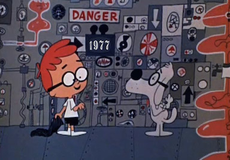

I started my blog [June 17, 2004](http://dtrace.org/blogs/ahl/2004/06/17/warm-up-the-propaganda-machine/), tempted by the opportunity of Sun’s blogging policy, and cajoled by [Bryan Cantrill](http://dtrace.org/blogs/bmc)’s presentation to the Solaris Kernel Team “Guerrilla Marketing” (net: Sun has forgotten about Solaris so let’s get the word out). I was a skeptical blogger. I even resisted the contraction “blog”, insisting on calling it “[Adam Leventhal's Weblog](https://blogs.oracle.com/ahl/)” as if linguistic purity would somehow elevate me above the vulgar blogspotter opining over toothpaste brands. (That linguistic purity did not, however, carry over into my early writing — my goodness it was painful to open that unearthed time capsule.)

A little about my blog. When I started blogging I was worried that I’d need to post frequently to build a readership. That was never going to happen. Fortunately aggregators (RSS feeds then; Twitter now) and web searches are far more relevant. My blog is narrow. There’s a lot about [DTrace](http://dtrace.org/blogs/ahl/tag/dtrace/) (a technology I helped develop), plenty in the last four years about [Delphix](http://dtrace.org/blogs/ahl/tag/delphix) (my employer), and samplings of [flash memory](http://dtrace.org/blogs/ahl/tag/flash/), [Galois fields](http://dtrace.org/blogs/ahl/tag/galoisfield/), [RAID](http://dtrace.org/blogs/ahl/tag/raid/), and musings on software and startups. The cumulative intersection consists of a single person. But — and this is hard to fathom — I’ve hosted a few hundred thousand unique visitors over the years. Aggregators pick up posts soon after posting; web searches drive traffic for years even on esoteric topics.

Ten years and 172 posts later, I wanted to see what lessons I could discern. So I turned to Google Analytics.

## Most popular

**3**. I was surprised to see that my posts on [double-](http://dtrace.org/blogs/ahl/2006/06/18/double-parity-raid-z/) and [triple-parity](http://dtrace.org/blogs/ahl/2009/07/21/triple-parity-raid-z/) RAID for ZFS have been among the most consistently read over the years since posting in 2006 and 2009 respectively. The former is almost exclusively an explanation of abstract algebra that I was taught in 2000, applied in 2006, and didn’t understand properly until 2009 — when wrote the post. The latter is catharsis from discovering errors in the published basis for our RAID implementation. I apparently considered it a personal affront.

**2**. When Oracle announced their DTrace port to Linux in 2011 a pair of posts [broke the news](http://dtrace.org/blogs/ahl/2011/10/05/dtrace-for-linux-2/) and then [deflated expectations](http://dtrace.org/blogs/ahl/2011/10/10/oel-this-is-not-dtrace/) — another personal affront — as the Oracle Linux efforts fell short of expectations (and continue to today). I had learned the lesson earlier that DTrace + a more popular operating system always garnered more interest.

**1**. In 2008 I [posted about a defect in Apple’s DTrace implementation]( http://dtrace.org/blogs/ahl/2008/01/18/mac-os-x-and-the-missing-probes/) that was the result of it’s paranoid DRM protection. This was my perfect storm of blogging popularity: DTrace, more popular OS (Max OS X!), Apple-bashing, and DRM! The story was snapped up by [Slashdot](http://www.developers.slashdot.org/story/08/01/22/2156244/Apple-Crippled-Its-DTrace-Port) (Reddit of the mid-2000s) as “Apple Crippled Its DTrace Port” and by [The Register’s Ashlee Vance]( http://www.theregister.co.uk/2008/01/22/sun_apple_dtrace/) (The Register's Chris Mellor of the mid-2000s) as “Apple cripples Sun's open source jewel: Hollywood love inspires DTrace bomb.” It’s safe to say that I’m not going to see another week with 49,312 unique visitors any time soon. And to be clear I’m deeply grateful to that original DTrace team at Apple — [the subject of a different post]( http://dtrace.org/blogs/ahl/2006/08/07/dtrace_on_mac_os_x/).

## And many more…

Some favorites of mine and of readers (views, time on site, and tweets) over the years:

**2004** [Solaris 10 11-20]( http://dtrace.org/blogs/ahl/2004/07/12/the-solaris-10-top-11-20/). Here was a fun one. Solaris 10 was a great release. Any of the top ten features would have been the headliner in a previous release so I did a series on some of the lesser features that deserved to make the marquee. (If anyone would like to fill in number 14, dynamic System V IPC, I'd welcome the submission.)

**2004** [Inside nohup -p](http://dtrace.org/blogs/ahl/2004/07/09/inside-nohup-p/). The nohup command had remained virtual untouched since being developed at Bell Labs by the late [Joseph Ossanna](http://en.wikipedia.org/wiki/Joe_Ossanna) (described as “a peach and a ramrod”). I enjoyed adding some 21st century magic, and suffocating the reader with the details.

**2005** [DTrace is open]( http://dtrace.org/blogs/ahl/2005/01/25/dtrace-is-open/). It truly was an honor to have DTrace be the first open source component of Solaris. That I took the opportunity to descend to crush depth was a testament to the pride I took in that code. (tsj and Kamen, I’m seeing your comments now for the first time and will respond shortly.)

**2005** [Sanity and FUD]( http://dtrace.org/blogs/ahl/2005/02/17/sanity-and-fud/). This one is honestly adorable. Only a naive believer could have been such a passionate defender of what would become Oracle Solaris.

**2005** [DTrace in the JavaOne Keynote]( http://dtrace.org/blogs/ahl/2005/06/28/dtrace-in-the-javaone-keynote/). It was a trip to present to over 10,000 people at Moscone. I still haven’t brought myself to watch the video. Presentation tip: to get comfortable speaking to an audience of size N simply speak to an audience of size 10N.

**2005** [The mysteries of \_init]( http://dtrace.org/blogs/ahl/2005/09/15/the-mysteries-of-_init/). I geeked out about some of the voodoo within the linker. And I’m glad I did because a few weeks ago that very post solved a problem for one of my colleagues. I found myself reading the post with fascination (of course having forgotten it completely).

**2008** [Hybrid Storage Pools in CACM](http://dtrace.org/blogs/ahl/2008/07/01/hybrid-storage-pools-in-cacm/). In one of my first published articles, I discussed how we were using flash memory — a niche product at the time — as a component in enterprise storage. Now, of course, flash has always been the obvious future of storage; no one had yet realized that at the time.

**2012** [Hardware Engineer]( http://dtrace.org/blogs/ahl/2012/02/12/hardware-engineer/). At Fishworks (building the ZFS Storage Appliance at Sun) I got the nickname “Adam Leventhal, Hardware Engineer” for my preternatural ability to fit round pegs in square holes; this post catalogued some of those experiments.

**2013** [The Holistic Engineer]( http://dtrace.org/blogs/ahl/2013/02/06/the-holistic-engineer/). My thoughts on what constitutes a great engineer; this has become a frequently referenced guidepost within Delphix engineering.

**2013** [Delphix plus three years]( http://dtrace.org/blogs/ahl/2013/09/13/delphix-plus-three-years/). Obviously I enjoy anniversaries. This was both a fun one to plan and write, and the type of advice I wish I had taken to heart years ago.

## You said something about lessons?

The popularity of those posts about DTrace for Mac OS X and Linux had suggested to me that controversy is more interesting than data. While that may be true, I think the real driver was news. With most tech publications regurgitating press releases, people appreciate real investigation and real analysis. (Though Google Analytics does show that popularity is inversely proportional to time on site i.e. thorough reading.)

If you want people to read (and understand) your posts, run a draft through one of those [online grade-level calculators](http://writingtester.com/). Don’t be proud of writing at a 12th grade level; rewrite until 6th graders can understand. For complex subjects that may be difficult, but edit for clarity. **Simpler is better**.

**Everyone needs an editor**. I find accepting feedback to be incredibly difficult -- painful -- but it yields a better result. Find someone you trust to provide the right kind of feedback.

Early on blogging seemed hokey. Today it **still** can feel hokey -- dispatches that feel directed at no one in particular. But **I'd encourage just about any engineer to start a blog**. It forces you to organize your ideas in a different and useful way, and it connects you with the broader community of users, developers, employees, and customers. For the past ten years I've walked into many customers who now start the conversation aware of topics and technology I care about.

Finally, reading those old blog posts was painful. I got (slightly) better the only way I knew how: repetition. Get the first 100 posts out of the way so that you can move on to the next 100. Don't worry about readership. Don't worry about popularity. Interesting content will find an audience, but think about your reader. **Just start writing**.
