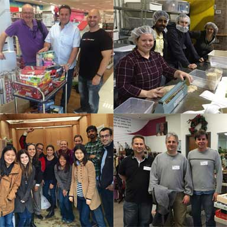

In the frenzied, insular world of a Silicon Valley startup it can be easy to lose perspective on the broader community in which we live and work. Among the great [hackathon projects](http://blog.delphix.com/eschrock/2013/enterprise-software-hackathons/) to come from our bi-annual engineering event was the idea of "Angel Sharks", a group of volunteers at Delphix who provide opportunities for volunteering and community giving. Earlier this year, this group organized [volunteer events](https://twitter.com/ahl/status/500524627550945281) around the launch of new Delphix releases.

We just completed our first "Week of Giving". While many at Delphix already donate their time and money, the Angel Sharks organized giving and corporate matching. Our theme for 2014 was hunger; we focused on the [SF-Marin Food Bank](http://www.sfmfoodbank.org) as our featured organization.

Over 50% of Delphix employees participated worldwide; a high bar that I'd like to see us exceed next year. Some activities of note were volunteering at food banks in the SF Bay Area, [Atlanta](http://nfcchelp.org) and [Boulder](http://communityfoodshare.org), toy donations to Toys for Tots, the Salvation Army Giving Tree, and the Starlight Foundation, and a silent auction that both brought the Delphix community closer together and raised over $3,000 for the SF-Marin Food Bank. More than $21,000 was raised in total with 30% of employees making matching requests in just three weeks! The Week of Giving brought a great energy and community spirit to the company; I'm excited to have giving as part of our DNA as a young company.

The SF-Marin Food Bank feeds 225,000 people annually with 47m lbs of food, and 96% of donations go directly to their programs. Donations are down for the year while need has increased by 1m lbs. You can donate [here](https://org2.salsalabs.com/o/5420/p/salsa/donation/common/public/?donate_page_KEY=447&track=header_button). I [volunteered](http://www.sfmfoodbank.org/volunteer) twice this year with my Delphix colleagues, and once with my wife and son (8 years old); I highly recommend it for both corporate and family outings.

Happy holidays from the Delphix family!
