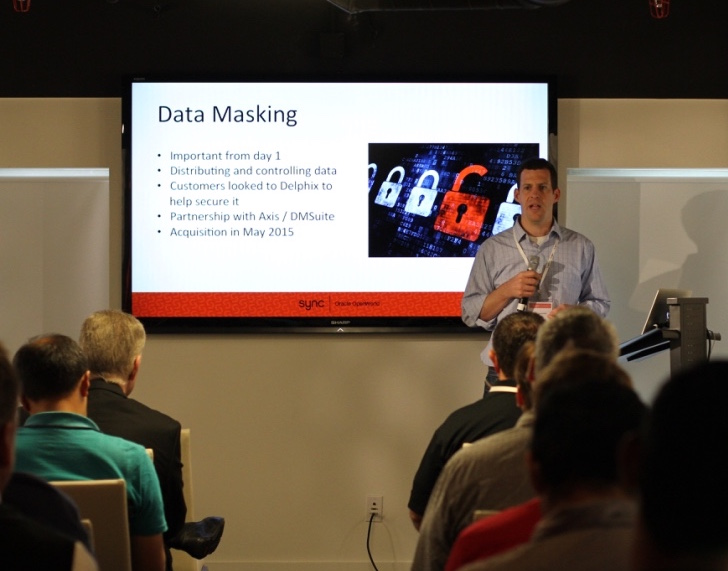

 Oracle OpenWorld is always a huge event for us at Delphix; it brings together our customers and partners like nothing else. And so it was the perfect venue to launch our new Delphix user group: Sync.

In its history Delphix has learned best from our customers. As I heard Marc Benioff opine at Dropbox’s inaugural event this morning, customers are the greatest source of a company’s innovation. At Delphix we’ve built an incredible multi-tool; our customers have taught us dozens of new ways of using it to deliver value to their organizations. Further, the most compelling education has always been user-to-user. Sync is the forum for local, global, live, and virtual events to build connections between users as well as directly into Delphix development.

Our Sync event last week featured customer speakers from McGraw Hill Financial, US Foods and Stubhub. A major theme was Delphix as a catalyst for devops implementation in the enterprise. We also shared performance best practices from Vinay Srihari, our VP of architecture, and engaged in a discussion about the product roadmap with deep-dives in particular areas.

There are many more events to come. We’ve already got a virtual event on masking and a local Seattle event in the works. I look forward to growing the community of Delphix users, and bringing them together. Stay connected or offer to host a Sync event by sending mail to [sync@delphix.com](mailto:sync@delphix.com).
