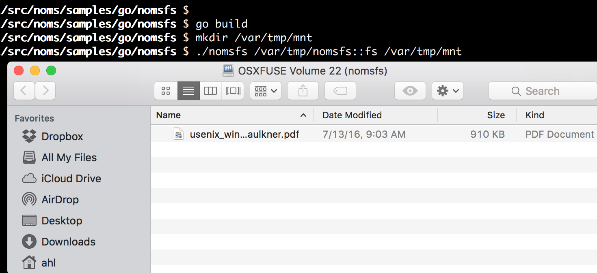

Since Noms [dropped last week](https://medium.com/@aboodman/noms-init-98b7f0c3566#.ev67mzuzr) the dev community has seemed into it. “Git for data” — it simultaneously evokes something very familiar and yet unconstrained. Something that hasn’t been well-noted is how much care the team has taken to make Noms fun to build with, and it is.

Noms is a content-addressable, decentralized, append-only database. It borrows concepts from a variety of interesting data systems. Obviously databases are represented: Noms is a persistent, transactional data repository. You can also see the fundamentals of git and other decentralized source code management tools. Noms builds up a chain of commits; those chains can be extended, forked, and shared, while historical data are preserved. Noms shares much in common with modern filesystems such as [ZFS](http://open-zfs.org/wiki/Main_Page), [btrfs](https://btrfs.wiki.kernel.org/index.php/Main_Page), or Apple’s forthcoming [APFS](http://arstechnica.com/apple/2016/06/a-zfs-developers-analysis-of-the-good-and-bad-in-apples-new-apfs-file-system/). Like those filesystems, Noms uses copy-on-write, never modifying data _in situ_; it forms a self-validating hierarchy of data; and it (intrinsically) supports snapshots and efficient movement of data between snapshots.

After learning a bit about Noms I thought it would be interesting to use it as the foundation for a filesystem. I wanted to learn about Noms, and contribute a different sort of example that might push the project in new and valuable ways. The Noms founders, Aaron and Raf, were fired up so I dove in…

## What’s Modern?

When people talk about a filesystem being “modern” there’s a list of features that they often have in mind. Let’s look at how the Noms database stacks up:

### Snapshots

A filesystem snapshot preserves the state of the filesystem for some future use — typically data recovery or fast cloning. Since Noms is append-only, every version is preserved. Snapshots are, therefore, a natural side effect. You can make a Noms “snapshot” — any commit in a dataset’s history — writeable by syncing it to a new dataset. Easy.

### Dedup

The essence of dedup is that unique data should be stored exactly once. If you duplicate a file, a folder, or an entire filesystem the storage consumption should be close to zero. Noms is content addressable, unique data is only ever stored once. Every Noms dataset intrinsically removes duplicated data.

### Consistency

A feature of a filesystem — arguably **the** feature of a filesystem — is that it shouldn’t ever lose or corrupt your data. One common technique to ensure consistency is to write new data to a new location rather than overwriting old data — so called copy-on-write (COW). Noms is append-only, it doesn’t throw out (or overwrite) old data; copying modified is required and explicit. Noms also recursively checksums all data — a feature of ZFS and btrfs, notably absent from APFS.

### Backup

The ability to backup your data from a filesystem is almost as important as keeping it intact in the first place. ZFS, for example, lets you efficiently serialize and send the latest changes between systems. When pulling or pushing changes git also efficiently serializes just the changed data. Noms does something similar with its structured data. Data differences are efficiently computed to optimize for minimal data transfer.

Noms has all the core components of a modern filesystem. My goal was to write the translation layer to expose filesystem semantics on top of the Noms interfaces.

## Designing a Schema

### Initially, Badly

It’s in the name: Noms eats all the data. Feed it whatever data you like, and let Noms [infer a schema as you go](https://github.com/attic-labs/noms/blob/c6d99f2fabcf870d9cf0cd4de9c540300de3f030/doc/intro.md#type-accretion). For a filesystem though I wanted to define a fixed structure. I started with a schema modeled on a simplified ZFS. Filesystems keep track of files and directories with a structure called an “inode” each of which has a unique integer identifier, the “inode number”. ZFS keeps track of files and directories with DMU objects named by their integer ID. The schema would use a Map<number, Inode> to serve the same function (**spoiler: read on and don’t copy this!**):

```go
struct Filesystem {
     inodes: Map<Number, struct Inode {
          attr: struct Attr { /* e.g. permissions, modification time, etc. */ }
          contents: Union {
               struct File { data: Ref /* Noms pile of bytes */ } |
               struct Directory { contents: Map<String, Number> }
          }
     }>
     rootInode: Number
     maxInode: Number
}
```

Nice and simple. Files are just Noms Blobs represented by a sequence of bytes. Directories are a Map of strings (the name of the directory entry) to the inode number; the inode number can be used to find the actual content by looking in the top-level map.

### Schema philosophy

This made sense for a filesystem. Did it make sense for Noms? I wasn’t trying to put the APFS team out of work, rather I was creating a portal from the shell or Finder into Noms. To evaluate the schema, I had the benefit of direct access to the Noms team (and so can all developers at [http://slack.noms.io/](http://slack.noms.io/)). I learned two guiding principles for data in Noms:

**Noms data should be self-validating.** As much as possible the application should rely on noms to ensure consistency. My schema failed this test because the relationship between inode numbers contained in directories and the entires of the inodes map was something my code alone could maintain and validate.

**Noms data should be deterministic.** A given collection of data should have a single representation; the Noms structures should be path and history independent. Two apparently identical datasets should be identical in the eyes of Noms to support efficient storage and transfer, and identical data should produce an identical hash at the root of the dataset. Here, again, my schema fell short because the inode number assigned to a given file or directory depended on how other objects were created. Two different users with two identical filesystems wouldn’t be able to simply sync the way they would with two identical git branches.

### A Better Schema

My first try made for a fine filesystem, just not a Noms filesystem. With a better understanding of the principles, and with help from the Noms team, I built this schema:

```go
struct Filesystem {
     root: struct Inode {
          attr: struct Attr { /* e.g. permissions, modification time, etc. */ }
          contents: Union {
               struct File { data: Ref<Blob> /* Noms pile of bytes */ } |
               struct Directory: { contents: Map<string, Cycle<1>> }
          }
     }
}
```

Obviously simpler; the thing that bears explanation is the use of so-called “Cycle” types. A Cycle is a means of expressing a recursive relationship within Noms types. The integer parameter specifies the ancestor struct to which the cycle refers. Consider a linked list type:

```go
struct LinkedList {
    data: Blob
    next: Cycle<0>
}
```

The “next” field refers to immediately containing struct, LinkedList. In our filesystem schema, a Directory’s contents are represented by a map of strings (directory entry names) to Inodes, Cycle<1> referring to the struct “above” or “containing” the Directory type. (Read on for a visualization of this.)

## Writing It

To build the filesystem I picked a [FUSE binding for Go](https://github.com/hanwen/go-fuse), dug into the Noms APIs, and [wrestled my way through some Go heartache](http://dtrace.org/blogs/ahl/2016/08/02/i-love-go-i-hate-go/).

Working with Noms requires a slightly different mindset than other data stores. Recall in particular that Noms data is immutable. Adding a new entry into a Map creates a new Map. Setting a member of a Struct creates a new Struct. Changing nested structures such as the one defined by our schema requires unzipping it, and then zipping it back together. Here’s a Go snippet that demonstrates that methodology for creating a new directory:

## Demo

Showing it off has all the normal glory of a systems demo! Check out the [documentation](https://github.com/attic-labs/noms/blob/master/samples/go/nomsfs/README.md) for requirements.

Create and mount a filesystem from a new local Noms dataset:

```console
$ go build
$ mkdir /var/tmp/mnt
$ go run nomsfs.go /var/tmp/nomsfs::fs /var/tmp/mnt
running...
```

You can open the folder and drop data into it.



Now let’s take a look at the underlying Noms dataset:

```console
$ noms show http://demo.noms.io/ahl_blog::fs
struct Commit {
  meta: struct {},
  parents: Set<Ref<Cycle<0>>>,
  value: struct Filesystem {
    root: struct Inode {
      attr: struct Attr {
        ctime: Number,
        gid: Number,
        mode: Number,
        mtime: Number,
        uid: Number,
        xattr: Map<String, Blob>,
      },
      contents: struct Directory {
        entries: Map<String, Cycle<1>>,
      } | struct Symlink {
        targetPath: String,
      } | struct File {
        data: Ref<Blob>,
      },
    },
  },
}({
  meta:  {},
  parents: {
    5v82rie0be68915n1q7pmcdi54i9tmgs,
  },
  value: Filesystem {
    root: Inode {
      attr: Attr {
        ctime: 1.4705227450393803e+09,
        gid: 502,
        mode: 511,
        mtime: 1.4705227450393803e+09,
        uid: 110853,
        xattr: {},
      },
      contents: Directory {
        entries: {
          "usenix_winter91_faulkner.pdf": Inode {
            attr: Attr {
              ctime: 1.4705228859273868e+09,
              gid: 502,
              mode: 420,
              mtime: 1.468425783e+09,
              uid: 110853,
              xattr: {
                "com.apple.FinderInfo": 00 00 00 00 00 00 00 00 00 00 00 00 00 00 00 00  // 32 B
                00 00 00 00 00 00 00 00 00 00 00 00 00 00 00 00,
                "com.apple.quarantine": 30 30 30 31 3b 35 37 38 36 36 36 33 37 3b 53 61  // 21 B
                66 61 72 69 3b,
              },
            },
            contents: File {
              data: dmc45152ie46mn3ls92vvhnm41ianehn,
            },
          },
        },
      },
    },
  },
})
```

You can see the type at the top and then the actual filesystem contents. Let’s look at more complicated example where I’ve taken [part of the Noms source tree and copied it to nomsfs](http://inception.davepedu.com/inception.mp3). You can navigate around its structure courtesy of the Splore utility (take particular note of nested directories that show the recursive data definition described above):

Embedded 'Splore! [http://splore.noms.io/?db=https://demo.noms.io/ahl\_blog&hash=2nhi5utm4s38hka22vt9ilv5i3l8r2ol](http://splore.noms.io/?db=https://demo.noms.io/ahl_blog&hash=2nhi5utm4s38hka22vt9ilv5i3l8r2ol)

<iframe width="100%" height="400px" scrolling="yes" src="http://splore.noms.io/?db=https://demo.noms.io/ahl_blog&amp;hash=2nhi5utm4s38hka22vt9ilv5i3l8r2ol"></iframe>

You can see the all of the various states that the filesystem has been through — each state change — using `noms log http://demo.noms.io/ahl\_blog::fsnoms`. You can sync it to your local computer with `noms sync http://demo.noms.io/ahl\_blog::fsnoms /var/tmp/fs` or checkout some previous state from the log (just like a filesystem snapshot). Diff two states from the log or make your own changes and diff it with the original using `noms diff`.

## Nom Nom Nom

It took less than 1000 lines of Go code to make Noms appear as a Window in the Finder, eating data as quickly as I could drag and drop ([try it!](https://github.com/attic-labs/noms/tree/master/samples/go/nomsfs)). Imagine what Noms might look like behind other known data interfaces; it could bring git semantics to existing islands of data. Noms could form the basis of a new type of [data lake](http://martinfowler.com/bliki/DataLake.html) — maybe one that’s simple and powerful enough to bring real results. Beyond the marquee features, Noms is fun to build with. I’m already working on my next Noms application.
