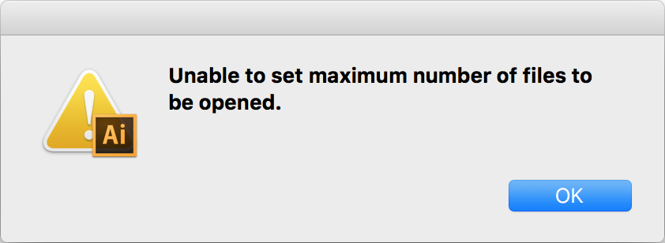

I had been procrastinating making the family holiday card. It was a combination of having a lot on my plate and dreading the formulation of our annual note recapping the year; there were some great moments, but I’m glad I don’t have to do 2016 again. It was just before midnight and either I’d make the card that night or leave an empty space on our friends’ refrigerators. Adobe Illustrator had other ideas:

[](http://ahl.dtrace.org/wp-content/uploads/2016/12/Screen-Shot-2016-12-17-at-7.03.00-PM.png)

I’m not the first person to hit this. The problem seems to have existed since CS6 was released in 2016. None of the solutions was working for me, and — inspired by Sara Mauskopf’s [excellent post](https://medium.com/startup-grind/how-to-start-a-company-with-no-free-time-b70fbe7b918a#.uujdblxc6) — I was rapidly running out of the time bounds for the project. Enough; I’d just DTrace it.

A colleague scoffed the other day, “I mean, how often do you actually use DTrace?” In his mind DTrace was for big systems, critical system, when dollars and lives were at stake. My reply: I use DTrace every day. I can’t imagine developing software without DTrace, and I use it when my laptop (not infrequently) does something inexplicable (I’m forever grateful to the [Apple team](http://dtrace.org/blogs/ahl/2006/08/07/dtrace_on_mac_os_x/) that ported it to Mac OS X).

First I wanted to make sure I had the name of the Illustrator process right:

```
$ sudo dtrace -n ‘syscall:::entry{ @[execname] = count(); }’
dtrace: description ‘syscall:::entry’ matched 500 probes
^C
pboard 1
watchdogd 2
awdd 3
...
com.apple.WebKit 7065
Google Chrome He 7128
Google Chrome 8099
Adobe Illustrato 36674
```

Glad I checked: “Adobe Illustrato”. Now we can be pretty sure that Illustrator is failing on `setrlimit(2)` and blowing up as result. Let’s confirm that it is in fact returning -1:

```
$ sudo dtrace -n 'syscall::setrlimit:return/execname == "Adobe Illustrato"/{ printf("%d %d", arg1, errno); }'
dtrace: description 'syscall::setrlimit:return' matched 1 probe
CPU     ID                    FUNCTION:NAME
  0    532                 setrlimit:return -1 1
```

There it is. And `setrlimit(2)` is failing with `errno` 1 which is `EPERM` (value too high for non-root user). I already tuned up the files limit pretty high. Let’s confirm that it is in fact setting the files limit and check the value to which it’s being set. To write this script I looked at the documentation for `setrlimit(2)` ([hooray for man pages!](https://truss.works/blog/2016/12/9/man-splained)) to determine that the position of the resource parameter (`arg0`) and the type of the value parameter (`struct rlimit`). I needed the DTrace `copyin()` subroutine to grab the structure from the process’s address space:

```
$ sudo dtrace -n 'syscall::setrlimit:entry/execname == "Adobe Illustrato"/{ this->r = *(struct rlimit *)copyin(arg1, sizeof (struct rlimit)); printf("%x %x %x", arg0, this->r.rlim_cur, this->r.rlim_max);  }'
dtrace: description 'syscall::setrlimit:entry' matched 1 probe
CPU     ID                    FUNCTION:NAME
  0    531                 setrlimit:entry 1008 2800 7fffffffffffffff
```

Looking through `/usr/include/sys/resource.h` we can see that 1008 corresponds to the number of files (`RLIMIT_NOFILE | _RLIMIT_POSIX_FLAG`). Illustrator is trying to set that value to 0x7fffffffffffffff or 2⁶³-1. Apparently too big; I filed any latent curiosity for another day.

The quickest solution was to use DTrace again to whack a smaller number into that `struct rlimit`. Easy:

```
$ sudo dtrace -w -n 'syscall::setrlimit:entry/execname == "Adobe Illustrato"/{ this->i = (rlim_t *)alloca(sizeof (rlim_t)); *this->i = 10000; copyout(this->i, arg1 + sizeof (rlim_t), sizeof (rlim_t)); }'
dtrace: description 'syscall::setrlimit:entry' matched 1 probe
dtrace: could not enable tracing: Permission denied
```

Oh right. Thank you [SIP](https://en.wikipedia.org/wiki/System_Integrity_Protection). This isa new laptop (at least a new motherboard due to some bizarre issue) which probably contributed to Illustrator not working when once it did. Because it’s new I haven’t yet disabled the part of SIP that prevents you from using DTrace on the kernel or in destructive mode (e.g. `copyout()`). [It’s easy enough to disable](http://internals.exposed/blog/dtrace-vs-sip.html), but I’m reboot-phobic — I hate having to restart my terminals — so I went to plan B: `lldb`.

First I used DTrace to find the code that was calling `setrlimit(2)`: using some knowledge of the x86 ISA/ABI:

```
$ sudo dtrace -n 'syscall::setrlimit:return/execname == "Adobe Illustrato" && arg1 == -1/{ printf("%x", *(uintptr_t *)copyin(uregs[R_RSP], sizeof (uintptr_t)) - 5) }'
dtrace: description 'syscall::setrlimit:return' matched 1 probe
CPU     ID                    FUNCTION:NAME
  0    532                 setrlimit:return 1006e5b72
  0    532                 setrlimit:return 1006e5b72
```

I ran it a few times to confirm the address of the `call` instruction and to make sure the location wasn’t [being randomized](https://en.wikipedia.org/wiki/Address_space_layout_randomization#OS_X). If I wasn’t in a rush I might have patched the binary, but Apple’s Mach-O Object format always confuses me. Instead I used `lldb` to replace the call with a store of 0 to `%eax` (to evince a successful return value) and some `nops` as padding (hex values I remember due to personal deficiencies):

```
(lldb) break set -n _init
Breakpoint 1: 47 locations.
(lldb) run
...
(lldb) di -s 0x1006e5b72 -c 1
0x1006e5b72: callq  0x1011628e0     ; symbol stub for: setrlimit
(lldb) memory write 0x1006e5b72 0x31 0xc0 0x90 0x90 0x90
(lldb) di -s 0x1006e5b72 -c 4
0x1006e5b72: xorl   %eax, %eax
0x1006e5b74: nop
0x1006e5b75: nop
0x1006e5b76: nop
```

Next I just `process detach` and got on with making that holiday card...

#### DTrace Every Day

DTrace was designed for solving hard problems on critical systems, but the need to understand how systems behave exists in development and on consumer systems. Just because you didn’t write a program doesn’t mean you can’t fix it.
