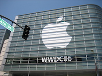
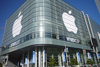
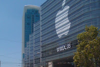
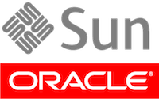

#### Prologue (2006)

I attended my first WWDC in 2006 to participate in Apple's [launch of their DTrace port](http://dtrace.org/blogs/ahl/2006/08/07/dtrace_on_mac_os_x/) to the next version of Mac OS X (Leopard). Apple completed all but the fiddliest finishing touches without help from the DTrace team. Even when they did meet with us we had no idea that they were mere weeks away from the finished product being announced to the world. It was a testament both to Apple’s engineering acumen as well as their storied secrecy.

At that same WWDC Apple announced Time Machine, a product that would record file system versions through time for backup and recovery. How were they doing this? We were energized by the idea that there might be another piece of adopted Solaris technology. When we launched Solaris 10, DTrace shared the marquee with ZFS, a new filesystem that was to become the standard against which other filesystems are compared. Key among the many features of ZFS were snapshots that made it simple to capture the state of a filesystem, send the changes around, recover data, etc. Time Machine looked for all the world like a GUI on ZFS (indeed the GUI that we had imagined but knew to be well beyond the capabilities of Sun).

Of course Time Machine had nothing to do with ZFS. After the keynote we rushed to an Apple engineer we knew. With shame in his voice he admitted that it was really just a bunch of [hard links to directories](http://arstechnica.com/staff/2006/08/4995/). For those who don’t know a symlink from a symtab this is the moral equivalent of using newspaper as insulation: it’s fine until the completely anticipated calamity destroys everything you hold dear.

So there was no ZFS in Mac OS X, at least not yet.

#### Not So Fast (2007)

A few weeks before WWDC 2007 nerds like me started to lose their minds: Apple really **was** going to port ZFS to Mac OS X. It was actually going to happen! Beyond the snapshots that would make backing up a cinch, ZFS would dramatically advance the state of data storage for Apple users. HFS was introduced in System 2.1 (“System” being what we called “Mac OS” in the days before operating systems gained their broad and ubiquitous sex appeal). HFS improved upon the Macintosh File System by adding—wait for it—hierarchy! No longer would files accumulate in a single pile; you could organize them in folders. Not that there were many to organize on those 400K floppies, but progress is progress. And that filesystem has limped along for more than 30 years, nudged forward, rewritten to avoid in-kernel Pascal code (though retaining Pascal-style, length-prefixed strings), but never reimagined or reinvented. Even in its most modern form, HFS lacks the most basic functionality around data integrity. Bugs, power failures, and expected and inevitable media failures all mean that data is silently altered. Pray that your old photos are still intact. When’s the last time you backed up your Mac? I’m backing up right now just like I do every time I think about the neglectful stewardship of HFS.

ZFS was to bring to Mac OS X data integrity, compression, checksums, redundancy, snapshots, etc, etc etc. But while energizing Mac/ZFS fans, Sun CEO, Jonathan Schwartz, had clumsily disrupted the momentum that ZFS had been gathering in Apple’s walled garden. Apple **had** been working on a port of ZFS to Mac OS X. They **were** planning on mentioning it at the upcoming WWDC. Jonathan, brought into the loop either out of courtesy or legal necessity, violated the cardinal rule of the Steve Jobs-era Apple. Only one person at Steve Job’s company announces new products: Steve Jobs. ["In fact, this week you'll see that Apple is announcing at their Worldwide Developer Conference that ZFS has become the file system in Mac OS 10,”](http://www.theregister.co.uk/2007/06/07/apple_using_zfs_in_leopard/) mused Jonathan at a press event, apparently to bolster Sun’s own credibility.

Less than a week later, Apple spoke about ZFS only when it became clear that a port was indeed present in a developer version of Leopard albeit in a nascent form. [Yes, ZFS would be there, sort of, but it would be read-only and no one should get their hopes up.](http://www.informationweek.com/apple-clarifies-status-of-zfs-file-system-in-mac-os/d/d-id/1056096?)

#### Ray of Hope (2008)

By the next WWDC it seemed that [Sun had been forgiven](http://www.zdnet.com/article/apple-announces-zfs-on-snow-leopard/). ZFS was featured in the keynotes, it was on the developer disc handed out to attendees, and it was even mentioned on the [Mac OS X Server website](http://web.archive.org/web/20080721031014/http://www.apple.com/server/macosx/snowleopard/). Apple had been working on their port since 2006 and [now it was functional enough to be put on full display](http://appleinsider.com/articles/08/06/23/five_undisclosed_features_of_apples_mac_os_x_snow_leopard). I took it for a spin myself; it was really real. The feature that everyone wanted (but most couldn’t say why) was coming!

#### The Little Engine That Couldn't (2009)

By the time Snow Leopard shipped only a careful examination of the Apple web site would turn up the [odd reference to ZFS left unscrubbed](https://web.archive.org/web/20090627034320/http://www.apple.com/xserve/specs.html). Whatever momentum ZFS had enjoyed within the Mac OS X product team was gone. I’ve heard a couple of theories and anecdotes from people familiar with the situation; first some relevant background.

[Sun was dying.](https://en.wikipedia.org/wiki/Sun_acquisition_by_Oracle) After failed love affairs with IBM and HP (the latter formed, according to former Sun CEO, Scott McNealy, by two garbage trucks colliding), Oracle scooped up the aging dame with dim prospects. The nearly yearlong process of closing the acquisition was particularly hard on Sun, creating uncertainty around its future and damaging its bottom line. Despite the well-documented personal friendship between Steve Jobs and Oracle CEO, Larry Ellison (more on this later), I’m sure this uncertainty had some impact on the decision to continue with ZFS.

In the meantime Sun and NetApp had been locked in a lawsuit over ZFS and other storage technologies since mid-2007. [While Jonathan Schwartz had blogged about protecting Apple and its users](https://web.archive.org/web/20080625023043/http://blogs.sun.com/jonathan/entry/harvesting_from_a_troll) (as well as Sun customers of course), this likely lead to further uncertainly. On top of that, filesystem transitions are far from simple. When Apple included DTrace in Mac OS X a point in favor was that it could be yanked out should any sort of legal issue arise. Once user data hit ZFS it would take years to fully reverse the decision. While the NetApp lawsuit never seemed to have merit (ZFS uses unique and from-scratch mechanisms for snapshots), it indisputably represented risk for Apple.

Finally, and perhaps most significantly, personal egos and NIH (not invented here) syndrome certainly played a part. I’m told by folks in Apple at the time that certain leads and managers preferred to build their own rather adopting external technology—even technology that was best of breed. They pitched their own project, an Apple project, that would bring modern filesystem technologies to Mac OS X. The design center for ZFS was servers, not laptops—and certainly not phones, tablets, and watches—his argument was likely that it would be better to start from scratch than adapt ZFS. Combined with the uncertainty above and, I’m told, no shortage of political savvy their arguments carried the day. Licensing FUD was thrown into the mix; even today folks at Apple see the ZFS license as nefarious and toxic in some way whereas the DTrace license works just fine for them. Note that both use the same license with the same grants and same restrictions. Maybe the technical arguments really were overwhelming (note however that ZFS was working internally on the iPhone), and maybe the risks really were insurmountable. I obviously have my own opinions, and think this was a great missed opportunity for the industry, but I never had the burden of weighing the totality of the facts and deciding. Nevertheless Apple put an end to its ZFS work; Apple’s from-scratch filesystem efforts were underway.

#### The Little Engine That Still Couldn’t (2010)

Amazingly that wasn’t quite the end for ZFS at Apple. [The architect for ZFS at Apple had left](https://www.linkedin.com/in/bradydon), the project had been shelved, but there were high-level conversations between Sun and Apple about reviving the port. Apple would get indemnification and support for their use of ZFS. Sun would get access to the Apple File Protocol (AFP—which, ironically, seems to have been collateral damage with the new APFS), and, more critically, Sun’s new ZFS-based storage appliance (which I helped develop) would be a natural server and backup agent for millions of Apple devices. It seemed to make some sort of sense.

The excruciatingly debilitatingly slow acquisition of Sun finally closed. The Apple-ZFS deal was brought for Larry Ellison’s approval, the first born child of the conquered land brought to be blessed by the new king. “I’ll tell you about doing business with my best friend Steve Jobs,” he apparently said, “I don’t do business with my best friend Steve Jobs.”

(Amusingly the version of the story told quietly at WWDC 2016 had the friends reversed with Steve saying that he wouldn’t do business with Larry. Still another version I’ve heard calls into question the veracity of their purported friendship, and has Steve instead suggesting that Larry go f\*ck himself. Normally the iconoclast, that would, if true, represent Steve’s most mainstream opinion.)

And that was the end.

#### Epilogue (2016)

In the 7 years since ZFS development halted at Apple, they’ve worked on a variety of improvements in HFS and Core Storage, and hacked at at least two replacements for HFS that didn’t make it out the door. This week Apple announced their new filesystem, APFS, after 2 years in development. It’s not done; some features are still in development, and they’ve announced the ambitious goal of rolling it out to laptop, phone, watch, and tv within the next 18 months. At Sun we started ZFS in 2001. It shipped in 2005 and that was really the starting line, not the finish line. Since then I've shipped the ZFS Storage Appliance in 2008 and Delphix in 2010 and each has required investment in ZFS / OpenZFS to make them ready for prime time. A broadly featured, highly functional filesystem takes a long time.

APFS has merits (more in my next post), but it will always disappoint me that Apple didn’t adopt ZFS irrespective of how and why that decision was made. Dedicated members of the OpenZFS community have built and maintain [a port](https://openzfsonosx.org). It’s not quite the same as having Apple as a member of that community, embracing and extending ZFS rather than building their own incipient alternative.
