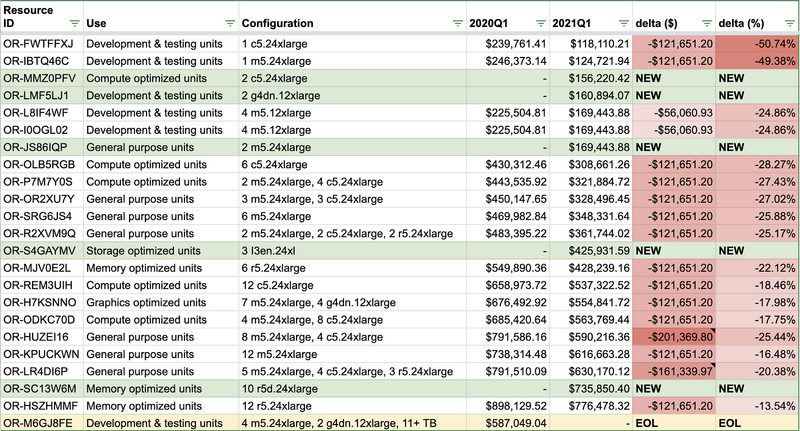
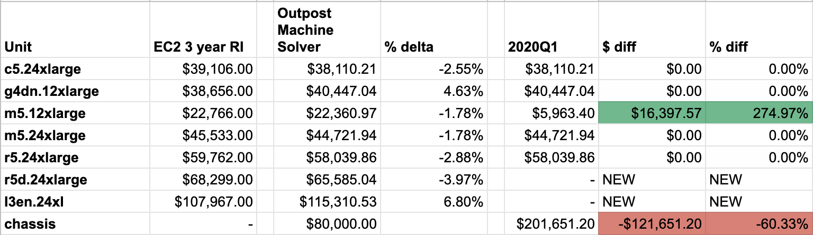
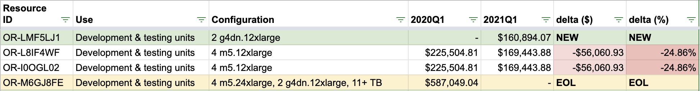
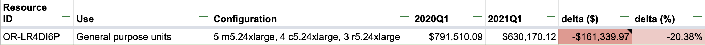
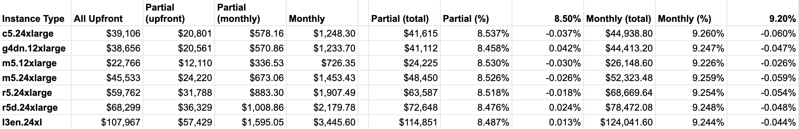
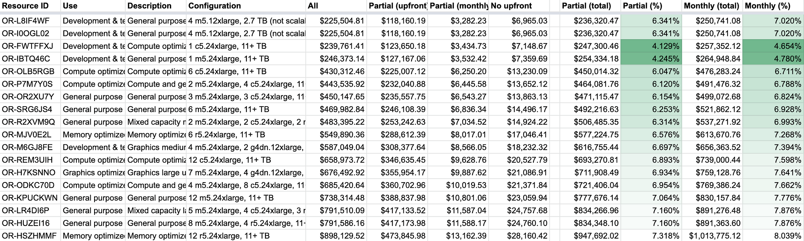
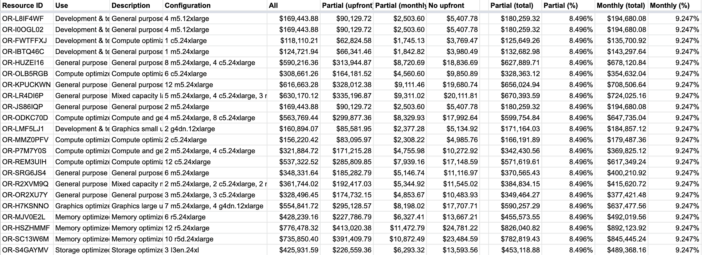
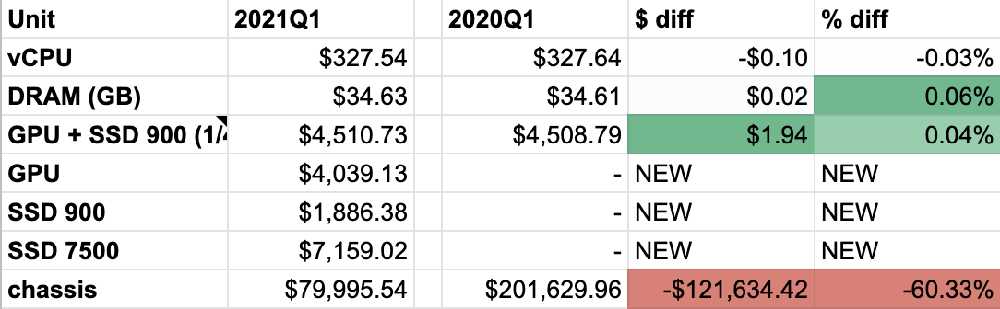
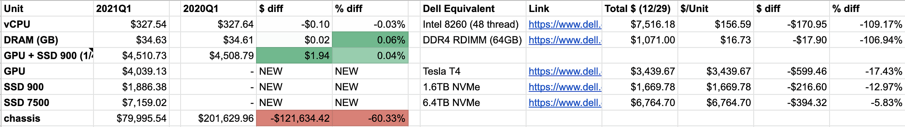

AWS Outposts is a rack-scale computer that runs on premises. The most recent re:Invent had a bunch of sessions about changes to Outposts. One change that happened without much fanfare is a new lower price (note: LOW-ER, not LOW). [I looked at Outposts pricing last year shortly after it was released.](https://medium.com/@ahl/aws-outposts-68e78592c7f8) As with that analysis there are some more stories and oddities hiding in the numbers: customer and sales feedback, trial balloons popped, months-long miscommunications, and --- as with any pandemic-era story --- a reversion to tedium.

<figure>

<figcaption>
Pricing changes from 2020 to 2021
</figcaption>
</figure>

AWS Outposts is an extension of the cloud that lives in your own facilities (either your DC or a colo). It's a 42U rack that comes with different quantities of EC2 instance types (and therefore different quantities of CPU threads (vCPUs), DRAM, GPUs, and SSD capacity). It's not a private cloud in that it is tightly bound to the AWS control plane (and a particular AWS region and availability zone). Rather, it's a little chunk of AWS physically close to your other systems.

All the analysis below is grounded on calculations you can find in [this spreadsheet](https://docs.google.com/spreadsheets/d/1UWtXpdIiw5UYXpqOOo3QC3uaNd30Ngaua9EwEfzYtMU/edit#gid=0").

## Margin Call

In last year's analysis we saw that the cover charge for an Outpost rack was about $200k before you start adding useful components like CPUs and DRAM. That's for the rack, the power, the switch, fans.. other stuff? Wheels? In case that doesn't sound crazy: it is. Deeply. The margin on those components must have been astronomical. Maybe some customers noticed and rebelled.

Outposts come in several flavors that support different EC2 instance types. The price of each model is a simple linear combination of the component instances whose prices we can derive. The new price of the rack is exactly $80k --- slightly more reasonable than it was last year.

The price reduction of the rack by $121,651.20 across all models accounts for all price changes except for 3: one reasonable, one kind of annoying, and one goofy.

## No dev unit stimulus

A year ago the cheapest dev unit (actually two models, distinguished only by their external network type) had a special discount. Each AWS Output model is advertised as supporting various EC2 instance types. Using some algebra (or Excel Solver) I calculated the price of each instance type in Outposts. Most are priced similarly to their (3 year reserved instance) cloud-operated EC2 analogs (±8%). Last year, however, the m5.12xlarge came at an 80% discount, but that instance type only came in the cheapest dev unit, making it --- ostensibly --- an attractive model to start with and kick the tires.

No more! In 2021, the m5.12xlarge is no longer an aberration (see above). The dev unit is still cheaper than it was a year ago, but only by $56k (not $121k) as it was --- effectively --- already discounted by $65k. The Jassy giveth and the Jassy taketh away. This also means it is no longer the cheapest model --- and it never should have been since other dev models with fewer vCPUs and less DRAM were previously more expensive.

<figure>

<figcaption>
Dev unit pricing has changed a bit
</figcaption>
</figure>

The smallest dev unit comes with 96 threads and 192GB of DRAM. Even with the new low (low!) price of $118k, that seems ... exploitative. A comparable server (singular) from Dell is about 1/5th of that price.

Note that of the instance types that appear in Outposts, the m5.12xlarge was the only one to see a significant price reduction when comparing the 3 year reserved instance price. I was pretty surprised by this. AWS epitomizes the intersection of relentless capitalism and steady technical advancement. Weren't we promised cheaper and cheaper computing in the cloud? Where's my Moore's Law dividend? As with so many incremental benefits, they're going disproportionately to the relentless capitalist. More on this later, but here's exhibit A on why the future isn't going to be one where Jeff Bezos owns and operates every computer on the planet.

## Price Correction

The OR-LR4DI6P is (with an asterisk) the most significantly discounted Outpost model. It supports a smattering of instance types tallying to 1152 vCPUs and 5TB of DRAM. The good news is that its price dropped $40k more than any other; the bad news is that it was previously overpriced by $40k. Last year I called this guy out as an anomaly. Was it overpriced to attempt to reduce the number of models? That seems weird for --- what was a year ago --- a new product line. Was it a divining rod for finding wells of dumb customers? Either away the experiment seems to be over.

The other short-lived experiment was the OR-M6GJ8FE which has been EOLed. With 2 x g4dn.12xlarge and 4 x m5.24xlarge, this was the only dev unit to include a GPU-enabled instance. It was also --- by far --- the most overpriced model, 21% / $125k more expensive than it should have been based on the per-instance type unit prices. It was hard to imagine a scenario where it should not have upgraded to the OR-H7KSNNO --- $90k more for 2 extra g4dn.12xlarge and 3 extra m5.24xlarge. It's been replaced, more or less, with the OR-LMF5LJ1 which just has 2 x g4dn.12xlarge for $161k.

## Comedy of errors

The largest nominal price reduction was for the OR-HUZEI16 with 8 x m5.24xlarge and 4 x c5.24xlarge (1152 vCPUs and 3840GB of DRAM). This guy dropped by $200k from $791,586.16 to $590,216.36.

The weird thing is that nothing changed in the unit math. A year ago it was priced exactly equal to the sum of its parts; same story this year. What changed, it turns out, was its parts. A year ago, those 4 x c5.24xlarge instances were 4 x r5.24xlarge; c5 means "half the memory of the m5" and r5 means "double the memory of the m5". Last year that higher price applied to a unit with an extra 2304GB of DRAM.

Looking back at my data from a year ago I now see that difference sources were inconsistent. The [website](https://docs.google.com/spreadsheets/d/1afmhB3UmMjWbb3QDH8QZh8-7A8xKA-xF0WvX3Oza1BE/edit#gid=2020069042&range=C18) said r5 while the [console](https://aws.amazon.com/blogs/aws/aws-outposts-now-available-order-your-racks-today/) (and [API](https://gist.github.com/ahl/5820dc0def00063b883c73e9e131c287#file-outposts-json-L184)) said c5.

There must have been a transcription error somewhere; clearly the quants in the pricing team were looking at the website (r5) and not the console (c5). Someone figured that out in the past year. I like to think it was a customer who went looking for their missing 2TB of DRAM.

## Amazon Financial Services

A quick note on the financing option. Outposts have three ways to buy: cash upfront, monthly installments, or monthly installments with 50% down. This is typical of other long term commitments in AWS. Check out the financing options in EC2:

<figure>

<figcaption>
That's what I call a cluster!
</figcaption>
</figure>

The terms are all within epsilon of 8.5% with half the money down, and 9.2% with $0 down.

In contrast, the 2019 rates for Outposts were as wild as you get in the office of the CFO:

<figure>

<figcaption>
Break out your D20 --- it's time to do some pricing!
</figcaption>
</figure>

Clearly someone put an end to that fun in 2020. The new rates are precisely 8.496% and 9.247%. No exceptions.

<figure>

<figcaption>

It <strong> is </strong> color-coded (there's just no variance).

</figcaption>
</figure>

## (Smaller) Component Pricing

Last year I just looked at the prices of each EC2 instance types that make up the Outpost models. I've spent the past year a lot closer to computer components so broke it down further, looking at the per vCPU (thread), GB of DRAM, GPU (an NVIDIA T4), and the SSDs. How? Excel's Solver function. It's seriously life-changing. I set up the inputs (the component prices) and then wrote formulas multiplying the price of each component by the number in each model to get the expected price per model. Solver will maximize or minimize a single value so I wrote a formula that sums the absolute values of the differences between actual and computed cost for each Outpost model. A few iterations of Solver later and I had this:

<figure>

<figcaption>
Find a CPU that costs more than $300 per thread. I'll wait.
</figcaption>
</figure>

AWS hasn't announced the pricing for their upcoming [2U Outpost](https://aws.amazon.com/outposts/1u-2u/#Features) model, but from this we can take a pretty good guess (the 1U will use a Graviton processor so we don't have data to extrapolate from for that model). 128 vCPUs, 512GB of DRAM, 8TB of SSD, plus some extra for a slimmed down chassis, I'd expect it to be something like $75k. Which is nuts.

Maybe AWS will surprise us, but I'm not holding my breath. Outposts are not just expensive but significantly overpriced --- despite the big drop and by quite a bit.

Take this next bit with a big grain of salt, but I picked some parts off the Dell website that seemed like fair comparisons. There might be more expensive parts in Outposts and I'm not accounting for all the other stuff that goes into a server, but CPU/DRAM/GPU/SSD are going to dominate everything else. Outposts pricing remains at least mildly rapacious.

## Conclusion

I understand why customers want Outposts. Despite the grousing in this post, I'm an AWS fan and have tremendous respect for their rate of innovation. Customers want API-driven infrastructure, the flexibility and speed of development that it provides. Traditional on-premises vendors, most concisely represented by the EMC/Dell/VMware conglomerate, have failed to evolve their way into this experience which is why the hardware and software from the hyperscalers (including Outposts) looks quite different. Customers are faced with a literal dilemma: on one hand they can continue buying the moderately priced, expensive to operate, inefficient to use, legacy gear from Dell/HPE/etc or they can pay exorbitantly for something like AWS Outposts. The former is throwing good money after bad, investing in an ecosystem that has continued to underdeliver; the latter cedes more and more control to AWS and locks them into an unaffordable future.

Shortly after writing my first blog post on this topic a year ago, I joined [Oxide](https://oxide.computer) where we're building a computer that combines the hardware and software lessons from the cloud with sensible economics. It's exciting building this computer the world needs.
