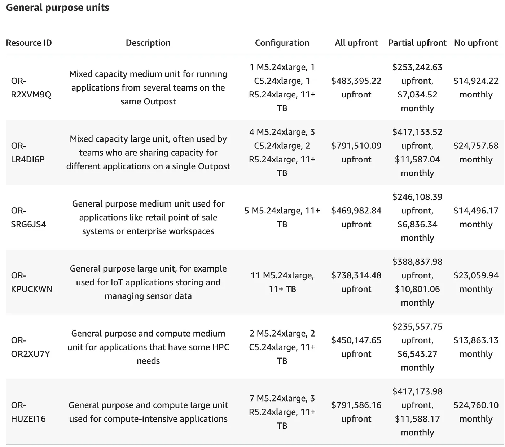
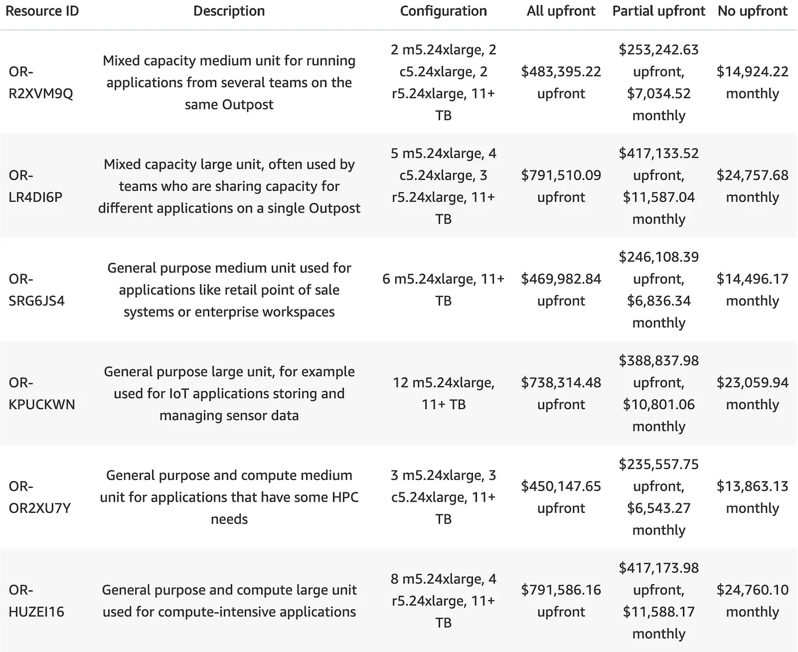

AWS announced Outpost a year ago. It’s a rack-scale computer that lets customers run a limited set of AWS services on-premises. A couple of weeks ago, AWS [announced](https://aws.amazon.com/blogs/aws/aws-outposts-now-available-order-your-racks-today/) that Outpost was out of beta and generally available.

Now that the pricing is public, I ripped apart the data. These are big, expensive boxes; what do you get for the money? How does it compare to running instances in the cloud?

What follows is the analysis I wanted, but couldn’t find. If you’ve been thinking “I wish I had a spreadsheet to get a deep understanding of Outpost pricing”, you’ve come to the right place. If you think spreadsheets are tedious, or perhaps a bizarre thing for a person to do in his idle time, spoiler: I’m going to get really excited about an Excel optimizer, conditionally color some cells, and use RATE() for the first time. So, yeah, it’s going to be wild / I won’t be offended if you leave after watching the “is it on-premise or on-premises?” supercut.

https://www.youtube.com/embed/RWHocP0AzMc?si=JB0W_g1Fm5NWnSUZ

<figure>
<figcaption>(1:06) AWS Outpost on-premises/premise announcement from re:Invent 2018</figcaption>
</figure>

Here’s the [Google Sheet](https://docs.google.com/spreadsheets/d/1afmhB3UmMjWbb3QDH8QZh8-7A8xKA-xF0WvX3Oza1BE/edit?usp=sharing) with all raw data and analysis.

### Data Gathering

We can see all the data: price, instance types, etc. But which data? On the morning of December 10th the data looked like this:

That afternoon, it looked like this:

Every instance type had its count incremented by one e.g. the first one, OR-R2XVM9Q, had 1 m5.24xlarge, c5.24xlarge, and r5.24xlarge and the later grab shows 2 of each.

I decomposed the configuration strings into a count of instances types for each Outpost configuration, and then plugged them into Excel’s Solver to figure out the Outpost pricing model. The numbers didn’t converge to a rational answer with the old data, but it did with the new data. So I’m sticking with the new data… even though the data in the AWS console (and the [JSON data](https://gist.github.com/ahl/5820dc0def00063b883c73e9e131c287)) still match the old data:

### Not an ARM

No surprise: [these suckers ain’t cheap](https://docs.google.com/spreadsheets/d/1afmhB3UmMjWbb3QDH8QZh8-7A8xKA-xF0WvX3Oza1BE/edit#gid=0). A quarter million for “Development & testing units” up to $900k for one chock-a-block full of memory. As with other term commitments from AWS, you can choose to pay all up front, pay in monthly installments, or pay a 50% downpayment with smaller monthly installments. Effectively Amazon lets you take out a mortgage on your outpost at around 7-8% — 0.7% less if you put 50% down.

The were notable outliers: the dev/test models with either a single c5.24xlarge or m5.24xlarge both had an interest rate closer to 4%. It makes sense that Amazon might want to make it a bit less painful to get that first evaluation Outpost in your lab, but it’s weird that that discount only applies to 2 of the 5 dev test models.

<figure>

<figcaption>The RATE() function is my new best friend</figcaption>
</figure>

### Outpost vs. Inpost

How do Outposts compare to the cost of running workloads in AWS? For this, I used reserve instance pricing with a 3 year term. I figure if you’re ready to drop some serious [racks](http://rack.urbanup.com/10983054) on this gear, a 3 year commitment probably doesn’t scare you. For this comparison I made the nominally gross simplification of ignoring storage (since that seems to have a consumption-based monthly component), power (a large and growing cost center), as well as other service charges (more on that in a bit).

For each Outpost configuration, I decomposed it into a count of the included instance types. I figured each Outpost probably had a fixed cost component (the rack itself, ToR, etc.) and then you’re just paying a fixed cost for each instance type. I mentioned Excel Solver earlier — it’s a brilliant tool to have at the ready, [go learn it if you haven’t already](https://support.office.com/en-us/article/define-and-solve-a-problem-by-using-solver-5d1a388f-079d-43ac-a7eb-f63e45925040)— on a spreadsheet with formulas, it modifies values (the Outpost cost for each instance type) and optimizes for a goal value (minimizing the delta between the computed and known cost for Outpost configurations). With the first set of data I pulled off the Outpost pricing page, the numbers weren’t converging at all, but with the new data they converged right away. In fact, it was pretty straightforward [to do by hand](https://docs.google.com/spreadsheets/d/1afmhB3UmMjWbb3QDH8QZh8-7A8xKA-xF0WvX3Oza1BE/edit#gid=784839167) with simple operations like this:

> m5.24xlarge = \
> (12 m5.24xlarge ($738,314) - m5.24xlarge ($246,373) ) / 11 = \
> $44,722

Now that we have the pricing model for Outpost, we can [compare](https://docs.google.com/spreadsheets/d/1afmhB3UmMjWbb3QDH8QZh8-7A8xKA-xF0WvX3Oza1BE/edit#gid=1454517013) it to the prices for the corresponding cloud-hosted instance.

<figure>

<figcaption>Friends and family discounts on the m5.12xlarge</figcaption>
</figure>

Most of them are close-ish. The obvious outlier is the m5.12xlarge instance type. This only appears in the two least expensive (dev/test) configs. So — as before — it might make sense that Amazon is trying to create financial incentives for that first development box.

The pricing model with values for the chassis and each instance type produces an [expected price for each config](https://docs.google.com/spreadsheets/d/1afmhB3UmMjWbb3QDH8QZh8-7A8xKA-xF0WvX3Oza1BE/edit#gid=2137790034). Only two aren’t spot on: a colossal $800k / 5TB memory config which is about 5% more expensive than we’d expect, and the GPU-enabled dev/test config which is a whopping 20% overpriced.

The 5% lift on the “Mixed capacity large unit” is hard to figure. Maybe they wanted to push people to the 6TB model which is only $70 (dollars — not kilo-dollars) more (aka two weeks of running an on-demand m5.24xlarge instance).

The dev/test “Graphics medium unit” is the only dev/test unit with a GPU (8 actually). It’s also the only dev/test that doesn’t have some sort of price incentive (on the contrary). On a relative basis it’s by far the most expensive Outpost config, and it’s hard to imagine why someone would opt for it over the “Graphics large unit”. For $90k more (15%) you go from 2 to 4 GPU-enabled instances and from 4 to 7 m5.24large. In short: weird price; it’s either an oversight or a story.

### Off Premise

Now that you’ve paid for it, wheeled it into your data center, and powered it, you’re good to go right? Sort of. You pay for the Outpost and then you keep paying by the hour. EBS is $0.15/GB-mo and up. Apparently the meter’s also running ECS and EKS, but the Outpost pricing page sends you to the ECS/EKS pricing pages which point back to the Outpost pricing page, so TBD on that. The managed database service (RDS) is available in Outposts, but it’s pretty expensive. For example, if you want to run MySQL on one of those m5.24xlarge instances in an Outpost that’s an $3.60/hr or $94,608 **on top of** the however many hundred thousand for the gear. Compare that to the 3 year, upfront cost, all-in cost to run that same database in AWS of $86,671 (no additional charge from EC2).

### Cloud Migration vs. Mitigation

An Outpost isn’t a hyperscaler-type computer you own and operate. It’s aptly named for what it is: an extension of AWS (indeed, linked to a particular region) with a limited set of services that sits on-premise in close proximity to other systems you might care about. Outposts meet a real need; I expect there’s an even larger need to build true private clouds with the efficiency of the hyperscalers.

The top tier Outpost comes with 576 cores (1152 vCPUs) and 9.2TB of DRAM for $900k. There’s margin in there for a system that meets the private cloud demand without falling farther down the AWS gravity well.

<figure>

<figcaption>Two day delivery with Prime… I assume</figcaption>
</figure>
