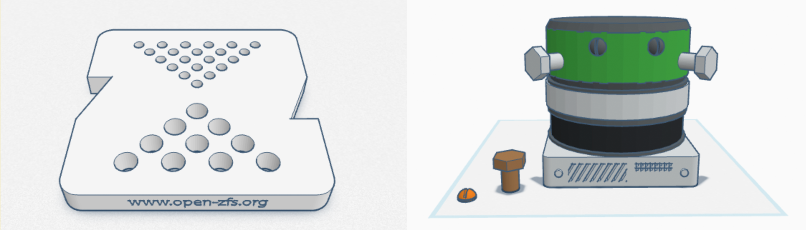
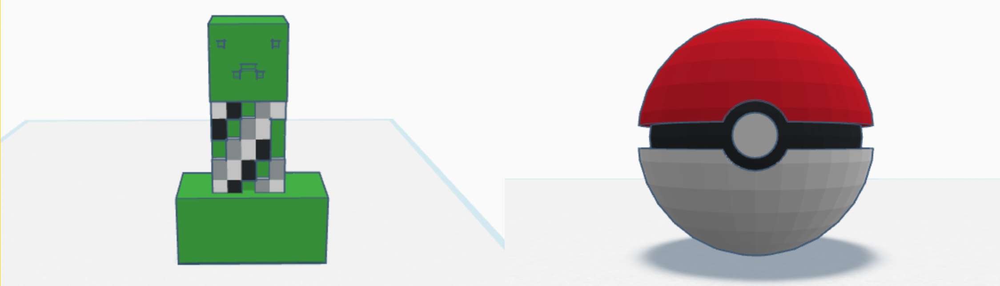
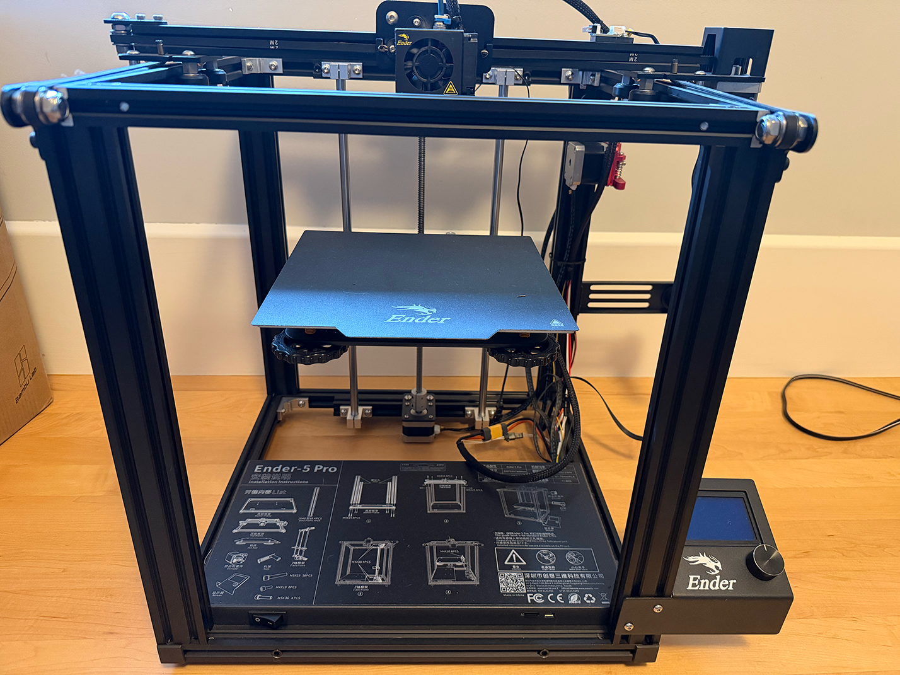
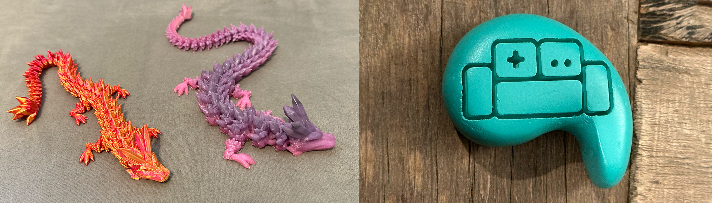
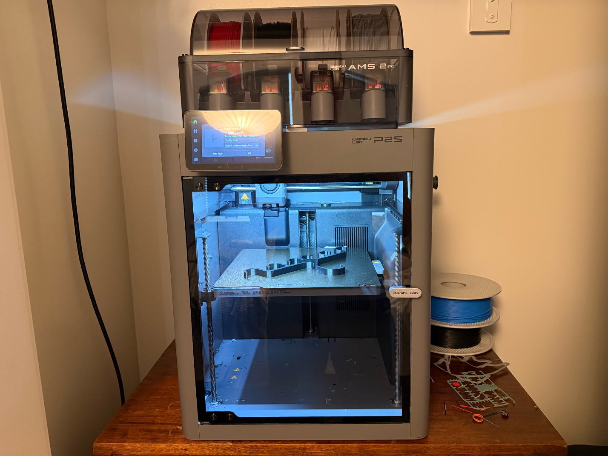

I've used a 3D printer in a hobby capacity off and on for over 10 years. I just
got a new printer and it is a **huge** leap above and beyond what I've used
before in terms of reliability and fun. If you've been curious, I can't
recommend it highly enough right now.

# Early days (2013)

I assume 3D printing sounds as magical to everyone as it did (does?) to me: a
machine that fabricates objects? Unreal. Of course, the reality is much more
more pedestrian... especially when I first started messing around in 2013. We
got a 3D printer (I don't recall the brand) at the office (Delphix) for no
particular purpose, but a buddy in marketing and I decided that revenue was up
enough, and the accounting team was bullish enough that we wouldn't get in too
much trouble expensing it.

We made some [OpenZFS](https://openzfs.org/) swag and some other weird stuff in
[Tinkercad](https://www.tinkercad.com/):

My son was 7 at the time. We had a great time designing stuff... and a less
great time actually fabricating stuff. Even a CAD program targeted at kids was
pretty challenging for me, and more challenging for a kid. Coaxing the printer
to actually make the stuff was harder. Usually we'd start it printing over the
weekend, and I'd come into the office on Monday to see if we had, say, a
Pokéball or a pile of spaghetti on the printer bed.

We did manage to make a box with a lid for his Pokémon cards that's still
floating around the house.

# Printing at home (2020)

Fast-forward a few years to August 2020. I'm sure we had exhausted every
possible at-home activity mid-pandemic so invested in a Creality Ender 5 Pro.
My son was now 14, and I think we both expected it to be a fun
activity--designing stuff, downloading designs, making neat stuff. It never was
particularly fun.

3D printing in that era required a bunch of tinkering. For each type of
filament and model, what was the right nozzle temperature, bed temperature? Was
the room the right temperature, was the head moving to fast or too slow? It
could have been a hobby we did together, but the multiplicative patience of
father and son never really met the required threshold. After failing to
produce the object we wanted several times, it just felt like a burden.

# Trying again (2024)

The avalanche of time continued, and my younger son and I unboxed the Ender 5
in late 2024. I came to it with new expectations for how focus, research, and
tinkering was required, and more reasonable expectation of what to expect from
a then-six-year-old. We made some neat stuff with designs we downloaded and a
few we remixed.

As the printer and the filament aged, and our patience declined, the hobby
became less of something we'd do together, and much more of a second job I did
at the behest of an impatient and quixotic boss. It wasn't fun.

# Fun... at last (2026)

A few weeks ago, my frustration bubbled over. I'm often a victim to the
sunk-cost fallicy; the printer we had, afterall, was **FINE**. But--I thought,
in rare moment of rationality--what if my time both were valuable and limited?
So I started exploring ways to buy my way to success. I settled on the [Bambu
Lab P2S](https://bambulab.com/en-us/p2s) and it is simply outstanding. Every
review and video gushed over its consistency and simplicity, and it's all true.

I could have paid less for one of the lesser models, but I've had enough
experience with both how fun 3D printing can be when it's working well, and how
frustrating it can be when it's not. I was willing to spend a bit more for a
good experience. 

Three weeks in, and the thing has been phenomenal. Literally my only gripe is
that I wasn't aware of the brand new model
([X2D](https://bambulab.com/en-us/x2d))--for another $100 we could have had
dual extruder heads, which would have made multi-color prints a bit easier.
Then the price dropped on the P2S by $100. I *would* be cranky, but Bambu Labs
gave me a $100 in store credit after the price drop--not cash, but I'll happily
spend it on filament.

# Now (also 2026)

Why did I write this? I'm genuinely excited for 3D printing, and my son (8) and
I are having a great time with it... finally! Decent printers are affordable,
and great printers are good value. The user experience is incredibly simple,
the results are great, and, best of all, we're having fun! If you like to
tinker, design, and build, or have a kid who does, it's a good time to give 3D
printing a shot.
