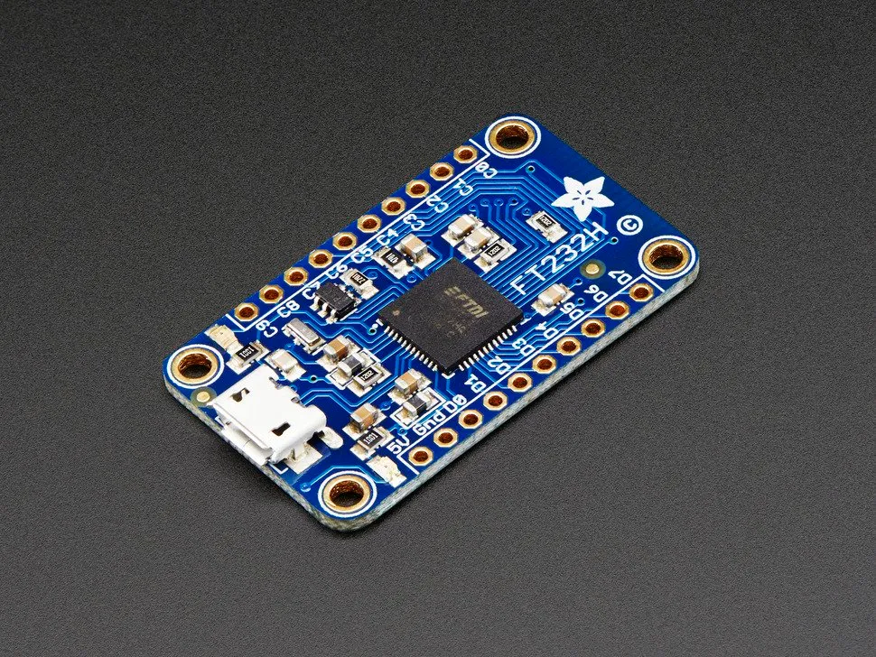

This was kind of a silly project. If I had known it would end with a bunch of wholesome Christmas decorations dancing along to Lizzo I probably would have done it a long time ago. Here’s the story of how I took some beloved kitsch, a logic analyzer, sed, awk, Google Sheets, Python, an FT232H, some wires, data from a VR game, and a few evenings to make it happen. (Just want the punchline? Skip to the end.)

## Happy Tapper eBay addiction

My family has a fair bit of music-producing stuff from Hallmark: books, stuffed animals, and, of course, holiday decorations. Chalk it up to an enthusiastic grandparent. The Happy Tappers are a favorite. We started with two — a reindeer and a snowman — and I was tasked with filling out the full set of four. We now have 13, so mission accomplished and then some.

<figure>

<figcaption>Some debate in my family about whose toys these are...</figcaption>
</figure>

Each Tapper plays two songs and dances; you can plug in other Tappers via ports on either side and they become backup dancers. Deeply alluring, clearly. I got a good deal on Santa, then a better deal on a different Santa. Then there was a great deal on a set of 4, so had to get it. Then — after months of waiting — I pounced on a set of 5, including the very rare “painter” elf. So, in short: I have a problem. This solstice holiday season my plan was to figure out how they work and get them to do some out-of-spec dancing.

https://www.youtube.com/embed/uUPnrAW0AUY

<figure>
<figcaption>Gotta catch 'em all</figcaption>
</figure>

## Vivisection

My first step was to pull one apart. There’s a microcontroller (covered with scratched up epoxy) that controls the speaker and electromagnet actuators while sending and receiving signals over the bus formed by connecting multiple Tappers (henceforth, the Dance Bus).

<figure>

<figcaption>Santa’s (X5053) brain</figcaption>
</figure>

Examination with a multimeter showed that pin 3 is ground, pin 2 is for dance signals, and pin 1 is high when one of the Tappers on the Dance Bus starts playing. I tried sending some pulses down pin 2, but that didn’t produce any tapping (happy or otherwise). So I hooked one up to my brand new logic analyzer.

## Reverse Choreography

You can spend a lot for a great logic analyzer which is what I didn’t do. I had never used a logic analyzer of any kind until a few weeks ago when I took a [hardware hacking class](https://hardwaresecurity.training/trainings/). Basically as a party favor for the class, we were each given a [BitMagic logic analyzer](https://1bitsquared.com/collections/all-products/products/bitmagic-basic) ($30) (worse, by the way, than the fancy [Saleae](https://www.saleae.com/) we used during the class). I used PulseView, the open source front-end, to gather and examine signal data. [The docs](https://sigrok.org/doc/pulseview/unstable/manual.html) were great; it was an testament to the power of open.

I hooked up the leads to the target Tapper, pushed the button, and… nothing. Its button didn’t work. Whether an artifact of the cheap logic analyzer or due to some pilot error, the logic analyzer was actually sending a signal — 3V measured between pins 1 and 3 — which means on the Dance Bus that a Tapper is active and others should expect to receive signals. I worked around this by pushing the Tapper’s button and then quickly hooking up the leads.

Here’s 15 seconds worth of Dance Bus activity in PulseView:


Each of those little blips corresponds to a message on the Dance Bus. Zooming in we can see a couple of the messages:


The cursor tool lets you measure the time between features:


I measured a few by hand, but it was going to be tedious to look at each signal that way. I needed the data in a form I could examine programmatically. PulseView has a bunch of output formats; the one I landed on (by trying them all) is “Value Change Data” whose output looks like this:

```text
$date Thu Dec 19 23:17:09 2019 $end
$version libsigrok 0.6.0-git-ef62ab6 $end
$comment
Acquisition with 1/8 channels at 1 MHz
$end
$timescale 1 us $end
$scope module libsigrok $end
$var wire 1 ! D0 $end
$upscope $end
$enddefinitions $end
#0 1!
#1291266 0!
#1309128 1!
#1311126 0!
#1313143 1!
#1315111 0!
#1319103 1!
#1321095 0!
#1323096 1!
#1325115 0!
```

Microsecond timestamps (noted in the header; perhaps due to the 1 MHz sampling frequency I used) and values at the time of changes (Value Change Data — in retrospect: duh). I stripped out the header and line prefixes with sed, then computed deltas between timestamps with awk:

```console
$ cat xx.vcd | sed -n 's/^#\(.*\)/\1/p' | awk 'NR>1{ print $1-last } { last=$1 }'
1291266
17862
1998
2017
1968
3992
1992
2001
2019
2002
289808
17531
1989
2010
1962
3978
1984
1995
2003
3958
```

The longest signals I care about appear to be no more than 18ms so I used some more awk to convert >20ms durations to newlines and everything else to CSV:

```console
$ cat xx.vcd | sed -n 's/^#\(.*\)/\1/p' | awk 'NR>1{ print $1-last } {last=$1 }' | awk '{ if ($1 < 20000) printf "%s,", $1; else print ""; }'
17862,1998,2017,1968,3992,1992,2001,2019,2002,
17531,1989,2010,1962,3978,1984,1995,2003,3958,
17811,1995,1999,1997,4020,1964,1999,1993,2005,
17631,1996,2020,1967,3995,1991,2003,2012,3973,
17676,1986,1995,2004,3953,1983,1990,1987,2013,
17765,2008,1993,1956,3978,1989,2011,1960,3979,
...
17788,1995,2001,2016,3970,1993,1999,1997,2022,
17959,1966,1998,1992,4018,1968,1999,1994,4003,
17525,1989,2009,1961,3977,1985,1994,2005,1997,
17612,1965,1997,1991,3998,2012,2001,1963,3993,
17879,1963,1990,1983,3981,2005,1994,1956,1992,
17782,1993,1998,1996,4015,1963,2000,1990,4018,
17968,1970,1997,1992,3998,2013,2001,1964,2002,81,2,
```

Scanning vertically, the numbers looked close enough that felt like I might be onto something, so I threw them into a [spreadsheet](https://docs.google.com/spreadsheets/d/1U8YG2iLemHUOoMn0lv56K9RbTZK-YdoSblHdrBGJE8M/edit?usp=sharing) to verify ([I ❤️ spreadsheets](https://blog.usejournal.com/aws-outposts-68e78592c7f8?)):


The signals looked pretty consistent until the last segment, 9 pulses of the following durations: 17.7ms, 2ms, 2ms, 2ms, 4ms, 2ms, 2ms, 2ms, ???. I split the last pulse into subsets above and below the average to get a pretty clear bimodal distribution, one right at 2ms and the other at 4ms:


Two signals for the two feet of each Tapper on the Dance Bus. I suppose I could have guessed that, but based on the preprogrammed dances I expected a single signal that just cycled from foot to foot. Now that I knew how the Tappers communicated to each other, I had to generate those signals myself.

## Tapping Out Signals

<figure>

<figcaption>Every kid wants an FT232H in their stocking</figcaption>
</figure>

Back when I was a kid (in the days before our serial buses were universal) PCs had a [parallel port](https://en.wikipedia.org/wiki/Parallel_port). You could hook up printers and other peripherals (like Zip Drives and slow-ass network devices), but with the tiniest bit of ingenuity you could write code to turn certain pins on and off. We used them to do really cool stuff like control LEDs… and control other LEDs. The possibilities were endless.

Another party favor from that hardware hacking class was an Adafruit FT232H Breakout ($15) which Limor Fried (founder of Adafruit) [called the “modern parallel port”](https://www.youtube.com/watch?t=965&v=CYBi0CEoR1A). It’s a USB bridge that you can use to speak useful, well-known protocols like SPI and I2C, or — in our case — less-useful, dance protocols via general purpose input/output (GPIO) pins. This thing is super cool: extremely approachable, easy to use, no IDE. It’s a great starting point for anyone who wants to write software that can control simple electronics.

The Tappers are ~4.5V (3 x AAA batteries) and the FT232H outputs 3V signals, but it’s what I had so I went with it. Adafruit operates mostly in Python so I went with that too. Because I was paranoid about the resolution of time.sleep() I decided to spin for the allotted time which resulted in this code:

<script src="https://gist.github.com/ahl/f8686793469df4479183229e24348221.js"></script>

And I tacked on a little interactive test program:

<script src="https://gist.github.com/ahl/db3341e0002394124430ccb40dca0c9c.js"></script>

Full of anticipation, I plugged in a Tapper expecting to j-k-j-k a little two-step and… nothing. So I hooked up the logic analyzer again, this time to my FT232H to see if it was producing the signals I expected. Here’s what I got:

<figure>

<figcaption>That first signal should be 17.7ms but is only 2ms</figcaption>
</figure>

The first low pulse that was supposed to be 17.7ms was only around 2ms. I thought a bit about the many sources of latency that could cause this, but then opted for urgency over curiosity, and added another 15.7 to that first value. I measured again and things looked good, so I hooked up the Tapper. Lo and behold, he started tapping:

https://youtu.be/XF2ZmL9MKeA

<figure>
<figcaption>One small tap for man…</figcaption>
</figure>

I could move their feet now I needed to make them dance.

## Tap Tap Revolution

I knew I couldn’t outtap the rhythmic geniuses from Hallmark, but I could tap into one of the great breakthroughs of our era: rhythm games. The greatest of these — in my completely unqualified opinions — is indisputably [Beat Saber](https://beatsaber.com/). It’s the killer app for VR. I’m not going to explain; just check it out:

https://youtu.be/-U6qPmxW0Cs

<figure>
<figcaption>VR is rad; mixed reality is incredible</figcaption>
</figure>

Beyond just the songs arranged by the developer, there’s an awesome community of content creators that make new songs available for download on [BeatSaver](https://beatsaver.com/) (and other places I infer). The file format is pretty simple. You can [check out the code](https://github.com/ahl/tapsaber/blob/master/tapsaber.py) if you want the details, but eventually you’ll poke deep enough in a JSON file to find an array of objects that look like this:

```json
{
  "_time": 51.875,
  "_lineIndex": 1,
  "_lineLayer": 0,
  "_type": 0,
  "_cutDirection": 7
}
```

Time is in units of beats (we get BPM elsewhere); index and layer indicate the location of the block to hit; cut direction is pretty self-explanatory; type indicates which hand you need to hit the block with. I ignored location and direction, and just used time and type. With some simple Python, I unpacked the file format, played the music, and fed the tap data into my Tappers. Here’s the result:

https://youtu.be/FCaSSJGif8g

<figure><figcaption>So last decade...</figcaption></figure>

You can plug in more Tappers to the Dance Bus so without further ado, Truth Hurts like you’ve never seen it before:

https://youtu.be/D0gZBMjndwc

<figure>
<figcaption> Took a DNA test, turns out I’m 100% that grinch...</figcaption>
</figure>

There were a bunch of moving parts; I was stoked (and surprised) to see it all come together. It turns out not to be that hard, and the parts weren’t that expensive. Give it a shot; just don’t outbid me on eBay.

---

Parts List:

*   Happy Tappers (available on eBay)
    
*   [BitMagic Basic Logic Analyzer from 1 Bit Squared](https://1bitsquared.com/collections/all-products/products/bitmagic-basic)
    
*   [PulseView](https://sigrok.org/wiki/Downloads)
    
*   [Adafruit FT232H Breakout — General Purpose USB to GPIO+SPI+I2C](https://www.adafruit.com/product/2264)
    
*   You’ll need some sort of soldering iron for the FT232H; I used my one from RadioShack in 1995
    
*   [Etekcity MSR-R500 Digital Multimeter](https://www.amazon.com/gp/product/B01N9QW620) (no endorsement other than it being cheap and available on Prime)
    
*   [HiLetgo 3pcs 400 Ties Mini Solderless Breadboard](https://www.amazon.com/gp/product/B00LSG5BJK) (not strictly necessary)
    
*   [EDGELEC 120pcs Breadboard Jumper Wires](https://www.amazon.com/gp/product/B07GD2BWPY)
    
*   Song data from [BeatSaver](https://beatsaver.com/)
    

Optional:

*   [Oculus Quest](https://www.oculus.com/quest) / HTC Vive + a gaming PC
    
*   [Beat Saber](https://beatsaber.com/)
    
*   Lots of time
